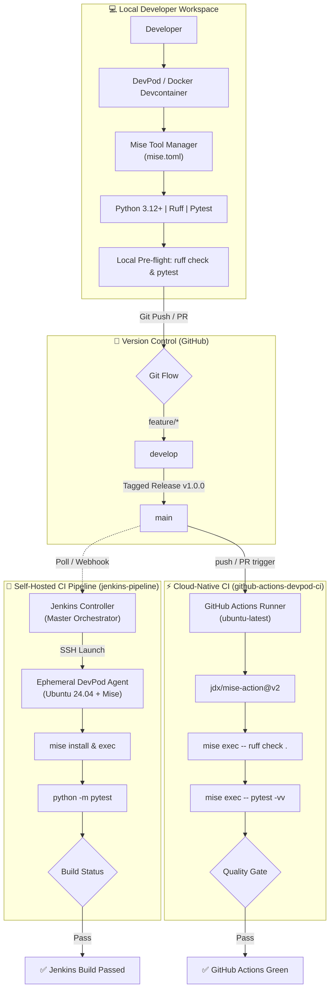
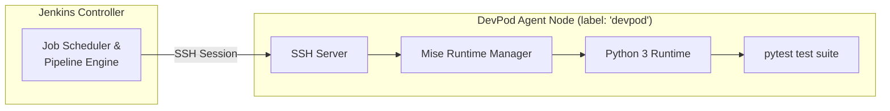

# 🏠 Home Lab: Tinkering & DevOps Portfolio

Welcome to my dedicated **Home Lab** repository! This is my personal playground where I experiment, learn, and master the art of DevOps and Infrastructure. It serves as both a laboratory for continuous learning and a showcase for my professional engineering portfolio.

## 🎯 The Mission
This repository is the central hub for all my home lab experiments. My goal is to:
- **Tinker & Learn**: Explore emerging technologies and architectural patterns by breaking and fixing them.
- **Automate Everything**: Move from manual setups to robust, repeatable Infrastructure as Code (IaC).
- **Showcase a Portfolio**: Document production-grade implementations of real-world DevOps workflows.

> **Note:** All my future home lab projects, experiments, and DevOps portfolio pieces will be hosted and maintained within this repository.

---

# 🏠 DevOps & Cloud Infrastructure Homelab

[](https://git-scm.com/)
[](https://devpod.sh/)
[](https://mise.jdx.dev/)
[](https://www.jenkins.io/)
[](https://github.com/features/actions)
[](https://www.python.org/)
[](https://docs.astral.sh/ruff/)
[](https://docs.pytest.org/)

Welcome to my central **DevOps & Cloud Infrastructure Homelab**! This repository serves as a hands-on proving ground and professional engineering portfolio for modern continuous integration, reproducible developer environments, automated testing quality gates, and infrastructure workflows.

---

## 🎯 Vision & Core Principles

The projects in this repository adhere to core production-grade DevOps methodologies:

1. **Reproducible Development Environments**: Leveraging [DevPod](https://devpod.sh/) and [Devcontainers](https://containers.dev/) backed by Docker to eliminate *"works on my machine"* syndrome across local workstations and remote build runners.
2. **Deterministic Polyglot Toolchains**: Managing language runtimes and tool versions declaratively using [Mise](https://mise.jdx.dev/) via `mise.toml`.
3. **Multi-Engine CI/CD Orchestration**: Designing robust pipelines across self-hosted orchestrators ([Jenkins](https://www.jenkins.io/)) with ephemeral container agents and cloud-native workflows ([GitHub Actions](https://github.com/features/actions)).
4. **Strict Quality & Test Automation**: Enforcing automated static analysis ([Ruff](https://docs.astral.sh/ruff/)) and unit test suites ([pytest](https://docs.pytest.org/)) before any artifact integration.
5. **Standardized Branching & Release Management**: Implementing structured Git branching models (Feature/Develop/Main) with semantic version tagging and controlled conflict resolution.

---

## 🏗️ Homelab Architecture Overview



---

## 🚀 Featured Projects & Labs

### 1. [Git Branching Workflow & Conflict Resolution](./git_branching_workflow_Demo/todo-app/)
> **Directory**: [`git_branching_workflow_Demo/`](./git_branching_workflow_Demo/) | **Sub-App**: [`todo-app/`](./git_branching_workflow_Demo/todo-app/)

A comprehensive lab demonstrating production-grade Git branching models, collaborative team workflows, and systematic merge conflict resolution using a client-side web application.

```text
main ──────●─────────────────────────────● [v1.0.0 Tagged Release]
           │                             ▲
develop    └──●───────────●──────────●───┘ [Integration Branch]
              │           ▲          ▲
feature/*     └──[feature]┘          └──[merge conflict resolution]
```

* **Workflow Implemented**:
  * `main`: Protected production branch containing only tested, tagged releases (`v1.0.0`).
  * `develop`: Integration branch where features are aggregated and validated.
  * `feature/*`: Short-lived task branches isolated from integration code.
* **Key Scenarios Practiced**:
  * Branch creation (`git checkout -b feature/add-task develop`), feature implementation, and local PR simulation.
  * Deliberate merge conflict injection between `develop` and `feature/update-ui` in shared UI components.
  * Manual conflict resolution, state verification, and clean fast-forward / merge commits.
* **Underlying App**: Vanilla HTML5, modern CSS3 Flexbox layout, and ES6+ JavaScript task tracker.

---

### 2. [Jenkins + Ephemeral DevPod CI Agent](./jenkins-pipeline/)
> **Directory**: [`jenkins-pipeline/`](./jenkins-pipeline/) | **Documentation**: [`README.md`](./jenkins-pipeline/README.md) & [`jenkins-devpod-things-learned-and-errors.md`](./jenkins-pipeline/jenkins-devpod-things-learned-and-errors.md)

A containerized Jenkins pipeline architecture where the **Jenkins Controller** delegates job execution over SSH to an isolated, reproducible **DevPod agent** running an Ubuntu 24.04 container managed with **Mise**.



* **Key Highlights & Technical Achievements**:
  * **Controller / Agent Separation**: Preserved controller stability by running builds exclusively on ephemeral DevPod worker nodes labeled `devpod`.
  * **Interactive vs. Non-Interactive Shell Mastery**: Solved `/bin/sh` shell limitation in CI by using explicit `mise exec python -- <command>` invocations instead of relying on `.bashrc`/`.zshrc` profile loading.
  * **Monorepo Directory Isolation**: Leveraged Jenkins `dir('jenkins-pipeline')` step scoping so `mise.toml` is correctly identified and executed relative to project subdirectories.
  * **Declarative Pipeline**: Structured build lifecycle with automated checkout, environment provisioning (`mise install`), dependency installation (`pip install -r requirements.txt`), and test execution (`pytest`).

---

### 3. [GitHub Actions CI with DevPod & Mise Toolchain](./github-actions-devpod-ci/)
> **Directory**: [`github-actions-devpod-ci/`](./github-actions-devpod-ci/) | **Documentation**: [`README.md`](./github-actions-devpod-ci/README.md) & [`errors.md`](./github-actions-devpod-ci/errors.md)

A cloud-native, production-grade Continuous Integration pipeline built with **GitHub Actions**, matching a containerized local development workflow powered by **DevPod** and **Mise**.

```text
[Trigger: Push / PR to main]
       │
       ▼
┌─────────────────────────────────────────────────────────────┐
│ GitHub Actions Runner (ubuntu-latest)                       │
│  ├─ 1. actions/checkout@v4                                  │
│  ├─ 2. jdx/mise-action@v2 (Install Mise toolchain)         │
│  ├─ 3. mise install (Python 3.12+, Ruff, pytest, pipx)      │
│  ├─ 4. mise exec -- ruff check . (Linter & style gate)      │
│  └─ 5. mise exec -- pytest -vv (5/5 Automated unit tests)   │
└─────────────────────────────────────────────────────────────┘
       │
       ▼
[Status: SUCCESS ✅]
```

* **Key Highlights & Technical Achievements**:
  * **Zero Dev/CI Drift**: Identical tool versions declared in `mise.toml` are used in both local DevPod containers and GitHub Actions runners via `jdx/mise-action@v2`.
  * **Strict Quality Gates**: Automated formatting and static analysis with **Ruff**, combined with granular test suites in **pytest**.
  * **Python Path Resolution**: Solved test discovery and relative module import issues across monorepos via `pytest.ini` (`pythonpath = .`).
  * **Validated Failure Resilience**: Verified pipeline integrity by injecting deliberate assertions (`assert add(2, 2) == 5`), observing pipeline failure, and verifying automated recovery upon fix.
  * **Systematic Post-Mortem**: Documented complete 10-step troubleshooting protocol and resolution steps in [`errors.md`](./github-actions-devpod-ci/errors.md).

---

## 📊 Pipeline Comparison Matrix

| Capability | Jenkins CI Lab (`jenkins-pipeline`) | GitHub Actions Lab (`github-actions-devpod-ci`) |
| :--- | :--- | :--- |
| **Orchestration Model** | Self-hosted controller with SSH agent execution | Fully managed cloud runner (`ubuntu-latest`) |
| **Agent Environment** | Ephemeral DevPod Docker container (Ubuntu 24.04) | Ephemeral GitHub Actions VM |
| **Runtime Management** | Mise (`mise.toml` executed via `mise exec`) | Mise (`jdx/mise-action@v2` + `mise exec`) |
| **Local / Remote Parity**| SSH-connected DevPod container | Docker-based DevPod container (`devpod up .`) |
| **Configuration Format**| Declarative Groovy (`Jenkinsfile`) | Declarative YAML (`.github/workflows/*.yml`) |
| **Quality Gates** | Automated `pytest` unit test verification | Static analysis with `ruff check` + `pytest -vv` |
| **Monorepo Handling** | Scoped via `dir('jenkins-pipeline') { ... }` | Scoped via `defaults.run.working-directory` |

---

## 📂 Repository Directory Structure

```text
.
├── README.md                              # Main Homelab documentation & portfolio overview
│
├── git_branching_workflow_Demo/           # Lab 1: Production Git workflows & conflict resolution
│   └── todo-app/                          # Client-side web application
│       ├── index.html                     # App markup & structure
│       ├── style.css                      # Styling & layout
│       ├── app.js                         # Application logic & DOM handlers
│       ├── README.md                      # Git branching workflow guide
│       └── screenshots/                   # Visual logs of branching & merge resolution
│
├── jenkins-pipeline/                      # Lab 2: Self-hosted Jenkins + DevPod SSH CI
│   ├── .devcontainer.json                 # Devcontainer agent configuration
│   ├── Dockerfile                         # Ubuntu 24.04 agent base with Mise
│   ├── Jenkinsfile                        # Declarative Jenkins pipeline script
│   ├── mise.toml                          # Toolchain config (Python, Java 21, Node, Jenkins CLI)
│   ├── app.py                             # Python sample application
│   ├── test_app.py                        # Pytest assertions
│   ├── requirements.txt                   # Project dependencies
│   ├── README.md                          # In-depth Jenkins CI documentation
│   ├── jenkins-devpod-things-learned-and-errors.md # Comprehensive debugging log
│   └── screenshots/                       # Jenkins dashboard & build execution proof
│
└── github-actions-devpod-ci/              # Lab 3: Cloud-native GitHub Actions + DevPod CI
    ├── .devcontainer.json                 # DevPod container configuration
    ├── Dockerfile                         # Devcontainer image definition with Mise
    ├── mise.toml                          # Declarative tool specifications (Python 3.12, Ruff, pytest)
    ├── pytest.ini                         # Pytest configuration (pythonpath = .)
    ├── README.md                          # Detailed GitHub Actions lab guide
    ├── errors.md                          # 10-step troubleshooting guide & error resolutions
    ├── src/                               # Application source code
    │   ├── __init__.py
    │   └── main.py                        # Core application module
    └── tests/                             # Automated test suite
        └── test_main.py                   # Pytest test cases
```

---

## 🛠️ Quickstart: Running Environments Locally

### Prerequisites

Ensure the following tools are installed on your workstation:
* [Docker](https://docs.docker.com/get-docker/) (Desktop or Engine)
* [DevPod](https://devpod.sh/) CLI or GUI
* [Mise](https://mise.jdx.dev/) tool manager
* [Git](https://git-scm.com/)

### 1. Launch a Lab with DevPod

You can spin up an isolated, reproducible container environment for any project in seconds:

```bash
# Launch GitHub Actions CI lab environment
devpod up github-actions-devpod-ci --provider docker

# Or launch Jenkins Pipeline lab environment
devpod up jenkins-pipeline --provider docker
```

### 2. Install & Verify Toolchains via Mise

Inside the container or project folder:

```bash
# Install exact tools specified in mise.toml
mise install

# Inspect active runtimes
mise ls

# Verify tool versions
mise exec -- python --version
mise exec -- pytest --version
```

### 3. Run Quality Gates & Tests Locally

```bash
# Run linting with Ruff (in github-actions-devpod-ci)
cd github-actions-devpod-ci
mise exec -- ruff check .

# Run unit tests
mise exec -- pytest -vv
```

---

## 🧭 Systematic Debugging & Troubleshooting Protocol

All pipeline errors and runtime issues encountered throughout these labs are resolved following a standardized 10-step diagnostic workflow:

```text
 1. Read the full error output and stack trace.
 2. Identify the exact failing command and current working directory (`pwd`).
 3. Isolate the affected architecture layer (Host, Docker, DevPod, Mise, Runtime, Git, CI).
 4. Verify binary resolution paths (`which <tool>`, `mise which <tool>`).
 5. Check declared vs runtime versions (`<tool> --version`, `python --version`).
 6. Isolate and test the smallest unit locally (e.g. `python -c "from src.main import add"`).
 7. Implement exactly ONE deliberate change at a time.
 8. Re-run validation under identical execution conditions.
 9. Confirm the fix without applying anti-patterns or code duplication.
10. Document root causes and prevention steps in the project error log.
```

---

## 🗺️ Homelab Roadmap

* [x] **Git Branching Strategies & Merge Conflict Resolution**
* [x] **Self-Hosted Jenkins CI with DevPod Container SSH Agents**
* [x] **Cloud-Native GitHub Actions CI with Mise & Ruff/Pytest Gates**
* [ ] **Multi-stage Docker Builds & Container Image Optimization**
* [ ] **Kubernetes Cluster Deployments & Manifest Orchestration**
* [ ] **Infrastructure as Code (IaC) with Terraform**
* [ ] **GitOps Continuous Delivery with ArgoCD / Flux**

---

## 📄 License & Notes

This repository is maintained as a personal DevOps homelab and professional portfolio. All configurations, scripts, and documentation are designed for learning, experimentation, and reference. Feel free to explore and adapt!

