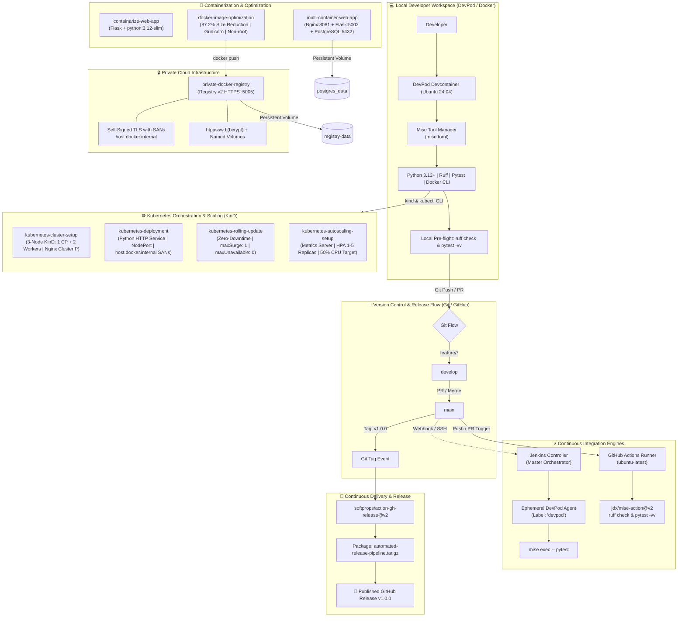
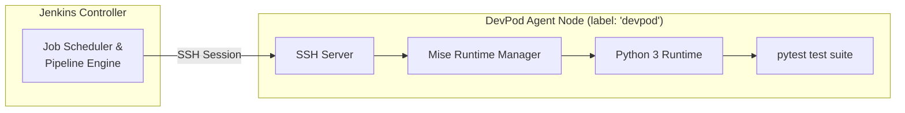
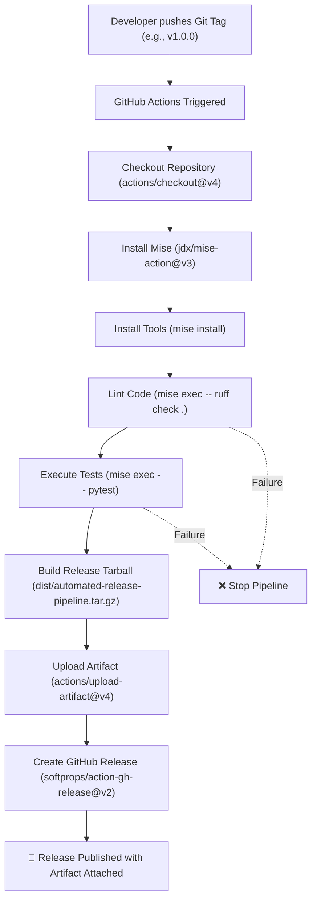
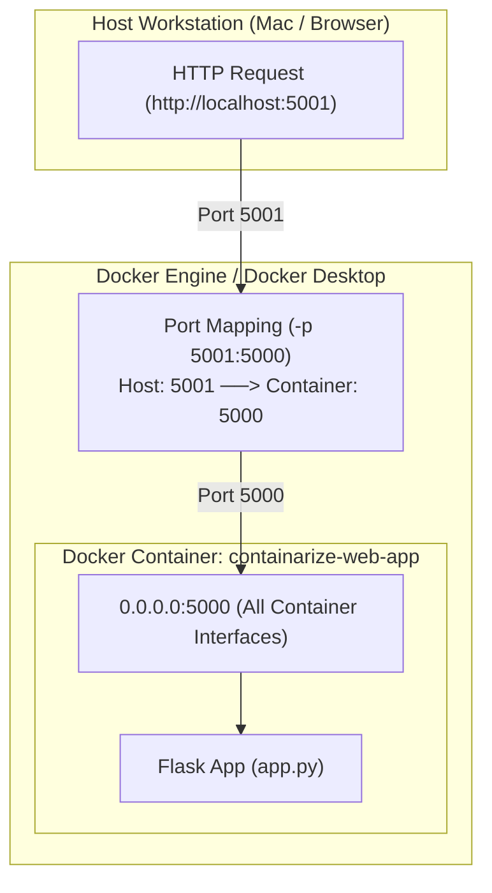
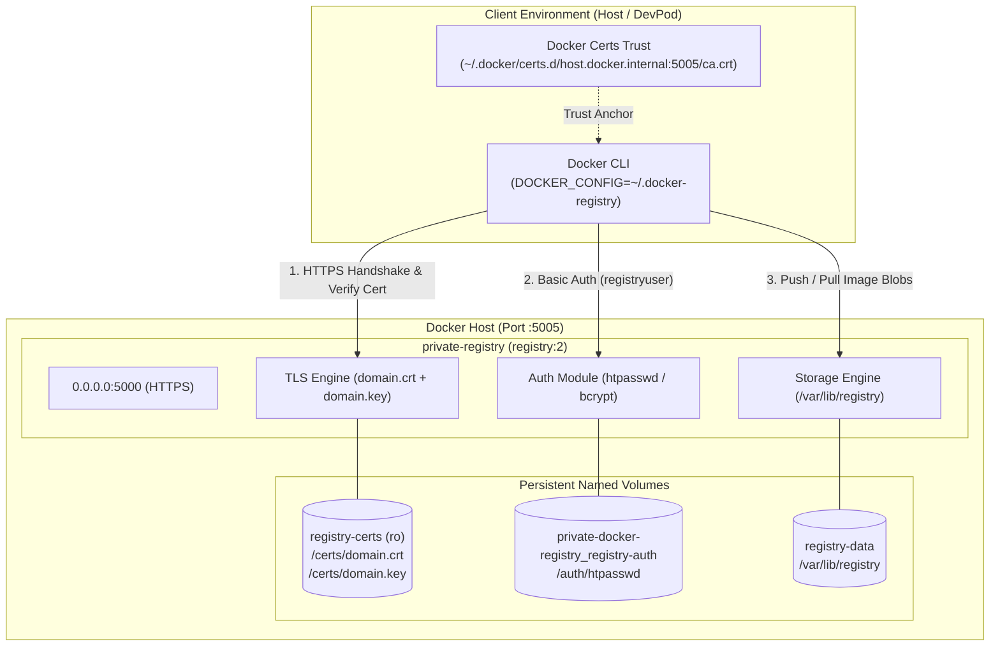
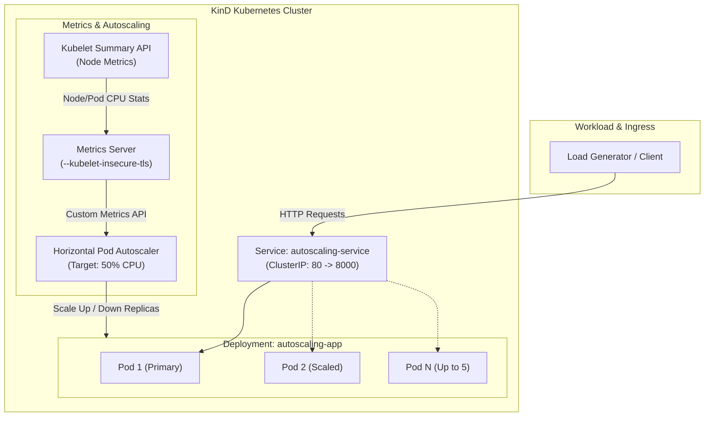

# 🏠 DevOps & Cloud Infrastructure Homelab

[](https://git-scm.com/)
[](https://devpod.sh/)
[](https://mise.jdx.dev/)
[](https://www.docker.com/)
[](https://docs.docker.com/compose/)
[](https://www.jenkins.io/)
[](https://github.com/features/actions)
[](https://www.python.org/)
[](https://flask.palletsprojects.com/)
[](https://www.postgresql.org/)
[](https://nginx.org/)
[](https://gunicorn.org/)
[](https://docs.astral.sh/ruff/)
[](https://docs.pytest.org/)
[](https://hub.docker.com/_/registry)
[](https://kubernetes.io/)
[](https://kind.sigs.k8s.io/)

Welcome to my central **DevOps & Cloud Infrastructure Homelab**! This repository serves as a hands-on proving ground and professional engineering portfolio for modern continuous integration, automated release delivery, containerization, image optimization, multi-tier microservice orchestration, private cloud registry infrastructure, reproducible development environments, automated quality gates, and declarative Kubernetes cluster orchestration with autoscaling.

---

## 🎯 Vision & Core Principles

The projects across this homelab adhere strictly to production-grade DevOps methodologies and cloud-native architectural patterns:

1. **Reproducible Development Environments**: Leveraging [DevPod](https://devpod.sh/) and [Devcontainers](https://containers.dev/) backed by Docker Desktop to eliminate *"works on my machine"* syndrome across local workstations and remote build runners.
2. **Deterministic Polyglot Toolchains**: Managing language runtimes, linters, and test runners declaratively using [Mise](https://mise.jdx.dev/) via version-pinned `mise.toml` configurations.
3. **Dual-Engine CI/CD Orchestration**: Designing robust pipelines across self-hosted orchestrators ([Jenkins](https://www.jenkins.io/)) with ephemeral container agents and cloud-native workflows ([GitHub Actions](https://github.com/features/actions)).
4. **Automated Release Engineering**: Converting Git tag events into fully automated release packaging, checksum generation, and published GitHub Releases with attached artifacts.
5. **Container Engineering & Optimization**: Crafting minimal, layer-cached, production-grade Docker images with non-root security compliance, achieving up to an **87.2% reduction in image weight**.
6. **Multi-Tier Microservice Topology**: Orchestrating full-stack services (Reverse Proxy, REST API, Relational Database) using Docker Compose with inter-service DNS, healthcheck dependencies, and persistent volumes.
7. **Private Infrastructure & Artifact Hosting**: Deploying an on-premise private Docker Registry v2 secured by TLS certificates with Subject Alternative Names (SANs) and HTTP Basic Authentication.
8. **Strict Quality Gates & Test Automation**: Enforcing automated static analysis ([Ruff](https://docs.astral.sh/ruff/)) and unit test suites ([pytest](https://docs.pytest.org/)) before any artifact build or merge.
9. **Standardized Branching & Release Management**: Implementing structured Git branching models (Feature/Develop/Main) with semantic version tagging and controlled conflict resolution.
10. **Cloud-Native Kubernetes Orchestration & Autoscaling**: Provisioning reproducible multi-node clusters on [KinD](https://kind.sigs.k8s.io/), enforcing zero-downtime rolling updates (`maxSurge` / `maxUnavailable`), configuring custom certificate SANs for nested container networking, and automating Horizontal Pod Autoscaling (HPA) driven by real-time Kubelet CPU metrics.

---

## 🏗️ Homelab Architecture Overview



---

## 📊 Homelab Projects Portfolio Matrix

| # | Project / Lab | Directory | Primary Stack | Key Capabilities & Concepts | Readme Reference |
| :-: | :--- | :--- | :--- | :--- | :--- |
| **1** | **Git Branching & Conflict Resolution** | [`git_branching_workflow_Demo/`](./git_branching_workflow_Demo/) | Git, HTML5, CSS3, ES6 JavaScript | Feature/Develop/Main branching, manual merge conflict resolution, semantic tagging | [`todo-app/README.md`](./git_branching_workflow_Demo/todo-app/README.md) |
| **2** | **Jenkins + Ephemeral DevPod CI Agent** | [`jenkins-pipeline/`](./jenkins-pipeline/) | Jenkins, DevPod, Docker, Mise, Python 3, Pytest | Controller-Agent SSH architecture, non-interactive `/bin/sh` handling with `mise exec`, monorepo scoping | [`README.md`](./jenkins-pipeline/README.md) |
| **3** | **Multi-Branch Pipeline Automation** | [`Multi-Branch_pipeline_Automation/`](./Multi-Branch_pipeline_Automation/) | Jenkinsfile, Docker, Python, Pytest, Mise | Declarative multibranch automation, dynamic branch testing, automated Docker image build | [`Multi-Branch Directory`](./Multi-Branch_pipeline_Automation/) |
| **4** | **GitHub Actions CI with DevPod & Mise** | [`github-actions-devpod-ci/`](./github-actions-devpod-ci/) | GitHub Actions, Mise, Ruff, Pytest, DevPod | Cloud-native CI runner, zero dev/CI drift, Ruff linting & Pytest test gates, intentional failure testing | [`README.md`](./github-actions-devpod-ci/README.md) |
| **5** | **Automated CI/CD Release Pipeline** | [`automated-release-pipeline/`](./automated-release-pipeline/) | GitHub Actions, Mise, Pytest, Ruff, GH Release v2 | Tag-triggered release flow, automated `.tar.gz` distribution packaging, auto-generated changelog & assets | [`README.md`](./automated-release-pipeline/README.md) |
| **6** | **Containerize a Web Application** | [`containarize-web-app/`](./containarize-web-app/) | Docker, Python 3.12-slim, Flask, DevPod, Mise | Multi-layer caching, `0.0.0.0` network binding, host port forwarding, Docker socket bind-mount | [`readme.md`](./containarize-web-app/readme.md) |
| **7** | **Docker Image Optimization & Hardening** | [`docker-image-optimization/`](./docker-image-optimization/) | Docker, Python 3.12-slim, Gunicorn, Pytest | **87.2% size reduction** (442MB ➔ 56.6MB), minimal base, layer caching order, non-root `appuser`, Gunicorn | [`README.md`](./docker-image-optimization/README.md) |
| **8** | **Multi-Container Web Application** | [`multi-container-web-app/`](./multi-container-web-app/) | Docker Compose v2, Nginx Alpine, Flask, PostgreSQL 16 | 3-tier microservice architecture, internal DNS, automated healthchecks (`pg_isready`), named volume persistence, CORS | [`README.md`](./multi-container-web-app/README.md) |
| **9** | **Private Docker Registry v2 with TLS & Auth** | [`private-docker-registry/`](./private-docker-registry/) | Docker Registry v2, OpenSSL TLS, Compose v2, htpasswd | TLS HTTPS with SANs, Basic Auth (`htpasswd` bcrypt), Docker named volumes, credential helper isolation | [`readme.md`](./private-docker-registry/readme.md) |
| **10** | **Kubernetes Homelab Cluster Setup** | [`kubernetes-cluster-setup/`](./kubernetes-cluster-setup/) | KinD, Kubernetes, Docker, Mise, Nginx | Multi-node cluster (1 Control-Plane, 2 Workers), Docker socket bind, ClusterIP service, cross-container networking | [`README.md`](./kubernetes-cluster-setup/README.md) |
| **11** | **Kubernetes Deployment Lab** | [`kubernetes-deployment/`](./kubernetes-deployment/) | Kubernetes, KinD, Python, Docker, NodePort | Declarative Deployments/Services, local image loading (`kind load`), certSANs (`host.docker.internal`), rolling update & rollback | [`README.md`](./kubernetes-deployment/README.md) |
| **12** | **Kubernetes Zero-Downtime Rolling Update** | [`kubernetes-rolling-update/`](./kubernetes-rolling-update/) | Kubernetes, KinD, Docker, Python, ClusterIP | Zero-downtime updates (`maxUnavailable: 0`, `maxSurge: 1`), ReplicaSet lifecycle, traffic continuity loop, automated rollback | [`README.md`](./kubernetes-rolling-update/README.md) |
| **13** | **Kubernetes Horizontal Pod Autoscaler (HPA)** | [`kubernetes-autoscaling-setup/`](./kubernetes-autoscaling-setup/) | Kubernetes HPA, KinD, Metrics Server, Python | Automated scaling (1-5 replicas, 50% CPU target), Metrics Server with `--kubelet-insecure-tls`, load generation with busybox | [`README.md`](./kubernetes-autoscaling-setup/README.md) |

---

## 🚀 Featured Projects & Labs

### 1. Git Branching Workflow & Conflict Resolution
> **Directory**: [`git_branching_workflow_Demo/`](./git_branching_workflow_Demo/) | **Sub-App**: [`todo-app/`](./git_branching_workflow_Demo/todo-app/) | **Documentation**: [`README.md`](./git_branching_workflow_Demo/todo-app/README.md)

A foundational lab demonstrating production-grade Git branching models, collaborative team workflows, and systematic merge conflict resolution using a client-side web application.

```text
main ──────●─────────────────────────────● [v1.0.0 Tagged Release]
           │                             ▲
develop    └──●───────────●──────────●───┘ [Integration Branch]
              │           ▲          ▲
feature/*     └──[feature]┘          └──[merge conflict resolution]
```

* **Branching Strategy**:
  * `main`: Protected production branch containing only tested, tagged releases (`v1.0.0`).
  * `develop`: Integration branch where features are aggregated and validated.
  * `feature/*`: Short-lived task branches (`feature/add-task`, `feature/update-ui`) isolated from integration code.
* **Key Scenarios Practiced**:
  * Branch creation (`git checkout -b feature/add-task develop`), feature implementation, and local PR simulation.
  * Deliberate merge conflict injection between `develop` and `feature/update-ui` in shared UI components (`<h1>` title tag).
  * Manual conflict resolution, state verification, and clean fast-forward / merge commits.
* **Underlying App**: Vanilla HTML5, modern CSS3 Flexbox layout, and ES6+ JavaScript task tracker.

---

### 2. Jenkins + Ephemeral DevPod CI Agent
> **Directory**: [`jenkins-pipeline/`](./jenkins-pipeline/) | **Documentation**: [`README.md`](./jenkins-pipeline/README.md) 

A containerized Jenkins pipeline architecture where the **Jenkins Controller** delegates job execution over SSH to an isolated, reproducible **DevPod agent** running an Ubuntu 24.04 container managed with **Mise**.



* **Key Highlights & Technical Achievements**:
  * **Controller / Agent Separation**: Preserved controller stability and security by running builds exclusively on ephemeral DevPod worker nodes labeled `devpod`.
  * **Non-Interactive Shell Mastery**: Solved `/bin/sh` shell limitations in CI by using explicit `mise exec python -- <command>` invocations instead of relying on `.bashrc`/`.zshrc` profile loading.
  * **Monorepo Directory Scoping**: Leveraged Jenkins `dir('jenkins-pipeline')` step scoping so `mise.toml` is correctly identified and executed relative to project subdirectories.
  * **Declarative Pipeline**: Automated checkout, environment provisioning (`mise install`), dependency installation, and test execution (`pytest`).

---

### 3. Multi-Branch Pipeline Automation
> **Directory**: [`Multi-Branch_pipeline_Automation/`](./Multi-Branch_pipeline_Automation/) | **Specification**: [`Jenkinsfile`](./Multi-Branch_pipeline_Automation/Jenkinsfile) & [`mise.toml`](./Multi-Branch_pipeline_Automation/mise.toml)

An automated CI automation pipeline configured for multi-branch repositories. It detects dynamic branch changes, executes unit test suites, and generates container artifacts automatically upon branch validation.

```text
[Multi-Branch Event: PR / Commit on feature/* or main]
       │
       ▼
┌─────────────────────────────────────────────────────────────┐
│ Jenkins Pipeline Engine                                     │
│  ├─ Stage 1: Checkout SCM (Dynamic Branch Resolution)       │
│  ├─ Stage 2: Install Dependencies (pip install pytest)      │
│  ├─ Stage 3: Automated Quality Gate (pytest -v)             │
│  └─ Stage 4: Artifact Generation (docker build -t app .)    │
└─────────────────────────────────────────────────────────────┘
       │
       ▼
[Status: SUCCESS ✅]
```

* **Key Highlights & Technical Achievements**:
  * **Dynamic Branch Testing**: Executes builds on any active branch in the repository without hardcoded pipeline definitions.
  * **Integrated Container Packaging**: Concludes pipeline runs with an automated Docker container build stage (`docker build -t multi-branch-pipeline-app .`).
  * **Declarative Toolchain**: Environment managed through `mise.toml` declaring Python, pytest, Ruff, Java, and Node runtimes.

---

### 4. GitHub Actions CI with DevPod & Mise Toolchain
> **Directory**: [`github-actions-devpod-ci/`](./github-actions-devpod-ci/) | **Documentation**: [`README.md`](./github-actions-devpod-ci/README.md) 

A cloud-native Continuous Integration pipeline built with **GitHub Actions**, matching a containerized local development workflow powered by **DevPod** and **Mise**.

```text
[Trigger: Push / PR to main]
       │
       ▼
┌─────────────────────────────────────────────────────────────┐
│ GitHub Actions Runner (ubuntu-latest)                       │
│  ├─ 1. actions/checkout@v4                                  │
│  ├─ 2. jdx/mise-action@v2 (Install Mise toolchain)         │
│  ├─ 3. mise install (Python 3.12+, Ruff, pytest, pipx)      │
│  ├─ 4. mise exec -- ruff check . (Linter & style gate)      │
│  └─ 5. mise exec -- pytest -vv (5/5 Automated unit tests)   │
└─────────────────────────────────────────────────────────────┘
       │
       ▼
[Status: SUCCESS ✅]
```

* **Key Highlights & Technical Achievements**:
  * **Zero Dev/CI Drift**: Identical tool versions declared in `mise.toml` are used across local DevPod containers and GitHub Actions runners via `jdx/mise-action@v2`.
  * **Strict Quality Gates**: Automated formatting and static analysis with **Ruff**, combined with granular test suites in **pytest**.
  * **Python Path Resolution**: Solved test discovery and relative module import issues across monorepos via `pytest.ini` (`pythonpath = .`).
  * **Validated Failure Resilience**: Verified pipeline integrity by injecting deliberate assertions (`assert add(2, 2) == 5`), observing pipeline failure, and verifying automated recovery upon fix.
 

---

### 5. Automated CI/CD Release Pipeline
> **Directory**: [`automated-release-pipeline/`](./automated-release-pipeline/) | **Documentation**: [`README.md`](./automated-release-pipeline/README.md)

An end-to-end automated Continuous Integration and Continuous Delivery (CI/CD) release pipeline for Python applications using **GitHub Actions**, **Mise**, **Pytest**, **Ruff**, and **DevPod**.



* **Key Highlights & Technical Achievements**:
  * **Tag-Triggered Distribution**: Automatically triggered when Git tags (e.g. `v1.0.0`) are pushed via `git push origin refs/tags/v1.0.0`.
  * **Deterministic Tooling**: Runtimes and linters pinned declaratively in `mise.toml` (Python 3.12, Ruff, Pytest, pipx).
  * **Artifact Packaging**: Packages verified source files, tool configs, and test setups into versioned archives (`dist/automated-release-pipeline.tar.gz`).
  * **Automated GitHub Releases**: Uses `softprops/action-gh-release@v2` with `contents: write` permissions to publish release notes and attach distribution archives.

---

### 6. Containerize a Web Application
> **Directory**: [`containarize-web-app/`](./containarize-web-app/) | **Documentation**: [`readme.md`](./containarize-web-app/readme.md) 

A practical containerization lab transforming a lightweight Python Flask web service into an isolated, reproducible Docker container, bridging Docker client operations between DevPod and Docker Desktop on macOS.



* **Key Highlights & Technical Achievements**:
  * **Docker Layer Caching**: Ordered Dockerfile instructions to copy `requirements.txt` and run `pip install` **before** copying `app.py`, ensuring fast incremental rebuilds.
  * **DevPod Socket Passthrough**: Mounted `/var/run/docker.sock` in `.devcontainer/devcontainer.json` to enable rootless/containerized Docker CLI execution against the host Docker daemon.
  * **Network Binding vs Port Forwarding**: Configured Flask to listen on `0.0.0.0:5000` (all interfaces) rather than `127.0.0.1`, and mapped host port `5001:5000` to avoid macOS AirPlay Receiver port collisions.
  * **Build Context Optimization**: Crafted `.dockerignore` to exclude Git history, Python caches (`__pycache__`), and local virtual environments from build contexts.

---

### 7. Docker Image Optimization & Security Hardening
> **Directory**: [`docker-image-optimization/`](./docker-image-optimization/) | **Documentation**: [`README.md`](./docker-image-optimization/README.md)

A deep-dive production engineering study on containerizing a Python/Flask web microservice. Contrasts an unoptimized baseline container with a hardened, minimal production container, achieving an **87.2% reduction in image size** and **85.4% reduction in disk usage**.

```text
BASELINE (Dockerfile.baseline)       OPTIMIZED (Dockerfile.optimized)
┌─────────────────────────────┐      ┌─────────────────────────────┐
│ Base: python:3.12           │      │ Base: python:3.12-slim      │
│ Extra: curl, git, vim       │ ──>  │ No extra OS packages        │
│ Cache: Broken layer order   │      │ Cache: Dependencies first   │
│ Server: Flask dev server    │      │ Server: Gunicorn WSGI       │
│ User: root (UID 0)          │      │ User: appuser (Unprivileged)│
└─────────────────────────────┘      └─────────────────────────────┘
  Image Size: 442 MB                   Image Size: 56.6 MB (-87.2%)
  Disk Usage: 1.75 GB                  Disk Usage: 256 MB (-85.4%)
```

* **Key Highlights & Technical Achievements**:
  * **Minimal Base Image Selection**: Switched from `python:3.12` (full Debian, 442 MB) to `python:3.12-slim` (56.6 MB), pruning ~385 MB of unused toolchains and build utilities.
  * **OS Package Pruning**: Removed unnecessary `apt-get install` packages (`curl`, `git`, `vim`), eliminating ~74 MB of bloat and reducing attack surface.
  * **Layer Caching Optimization**: Reordered instructions so `COPY requirements.txt` and `pip install` occur before application files, enabling instant rebuilds upon code changes.
  * **Production WSGI Server**: Replaced Flask's single-threaded development server with **Gunicorn** (`gunicorn --bind 0.0.0.0:5000 app:app`) for production concurrency.
  * **Security Hardening (Non-Root)**: Created dedicated unprivileged system user `appuser` (`USER appuser`, `COPY --chown=appuser:appuser`) to protect host systems against container breakout exploits.

---

### 8. Multi-Container Web Application (3-Tier Architecture)
> **Directory**: [`multi-container-web-app/`](./multi-container-web-app/) | **Documentation**: [`README.md`](./multi-container-web-app/README.md) 

A multi-tier web application orchestrated with **Docker Compose v2**, featuring an **Nginx** reverse/static frontend, a **Python Flask** REST API backend, and a **PostgreSQL 16** relational database.

```text
                         Host Machine (Browser / curl)
                                     |
               +---------------------+---------------------+
               |                                           |
               | http://localhost:8081                     | http://localhost:5002
               v                                           v
       +---------------+                           +---------------+
       |   frontend    |  (Browser API Fetch)      |    backend    |
       |  Nginx Alpine |-------------------------->|     Flask     |
       | (Port 80)     |                           | (Port 5000)   |
       +---------------+                           +-------+-------+
                                                           |
                                                           | database:5432
                                                           v
                                                   +---------------+
                                                   |   database    |
                                                   | PostgreSQL 16 |
                                                   | (Port 5432)   |
                                                   +-------+-------+
                                                           |
                                                           v
                                                  [ postgres_data ]
                                                   (Named Volume)
```

* **Service Topology**:
  * **`frontend`** (Nginx Alpine): Port `80` (Container) ➔ Port `8081` (Host) – Serves static HTML/JS UI.
  * **`backend`** (Python 3.12 / Flask): Port `5000` (Container) ➔ Port `5002` (Host) – REST API & DB client.
  * **`database`** (PostgreSQL 16): Port `5432` (Container) – Internal bridge network only.
* **Key Highlights & Technical Achievements**:
  * **Automated Health Checks**: PostgreSQL verified via `pg_isready`, Flask via `urllib.request`, and Nginx via `wget --spider`.
  * **Dependency Orchestration**: Backend startup is gated by `depends_on` with `condition: service_healthy` on `database`. Flask does not launch until PostgreSQL is fully accepting queries.
  * **CORS Management**: Configured `Flask-CORS` to securely permit cross-origin asynchronous requests from frontend (`localhost:8081`) to backend (`localhost:5002`).
  * **Data Persistence**: Backed by Docker named volume `postgres_data`, ensuring database records persist through container stops, deletions, and rebuilds.

---

### 9. Standalone Private Docker Registry v2 with TLS & Authentication
> **Directory**: [`private-docker-registry/`](./private-docker-registry/) | **Documentation**: [`readme.md`](./private-docker-registry/readme.md) 

A secure, standalone private Docker Registry (v2) configured with HTTPS (TLS), basic authentication (`htpasswd`), persistent Docker named volumes, and integration with containerized development environments on macOS.



* **Key Highlights & Technical Achievements**:
  * **TLS / HTTPS Security**: Self-signed x509 certificates generated with OpenSSL containing Subject Alternative Names (SANs) for `host.docker.internal`, `localhost`, and `127.0.0.1`.
  * **Daemon Trust Store Integration**: Ingested CA certificates into Docker's trust store (`~/.docker/certs.d/host.docker.internal:5005/ca.crt`) to prevent `x509: certificate signed by unknown authority` errors.
  * **HTTP Basic Authentication**: Enforced bcrypt-hashed credentials stored securely in a dedicated `htpasswd` volume.
  * **Named Volume Decoupling**: Solved macOS Docker Desktop bind-mount latency, missing path sharing permissions, and read-only mount issues by utilizing Docker-managed named volumes (`registry-data`, `registry-certs`, `registry-auth`).
  * **Credential Helper Isolation**: Outlined a dedicated `DOCKER_CONFIG=~/.docker-registry` workflow to prevent desktop credential helper mismatches during automated push/pull operations.

---

### 10. Kubernetes Homelab Cluster Setup
> **Directory**: [`kubernetes-cluster-setup/`](./kubernetes-cluster-setup/) | **Documentation**: [`README.md`](./kubernetes-cluster-setup/README.md)

A reproducible, declarative local multi-node Kubernetes homelab environment running on **KinD** (Kubernetes in Docker), provisioned within a **Dev Container / DevPod** development environment and managed via **Mise**.

```text
+-----------------------------------------------------------------------+
| Host Machine (macOS / Linux / Windows)                                |
|                                                                       |
|   +---------------------------------------------------------------+   |
|   | Dev Container / DevPod (Ubuntu 24.04 via Docker Socket Bind)   |   |
|   | Tooling: mise (docker-cli, kind, kubectl)                      |   |
|   +---------------------------------------------------------------+   |
|                                |                                      |
|                       Docker Engine Daemon                            |
|                                |                                      |
|   +----------------------------+----------------------------------+   |
|   | KinD Docker Network (kind bridge)                             |   |
|   |                                                               |   |
|   |  +------------------------+      +-------------------------+  |   |
|   |  | control-plane          |      | worker-1                |  |   |
|   |  | - kube-apiserver:6443  |      | - nginx pod replica 1   |  |   |
|   |  | - etcd, controller-mgr |      | - nginx pod replica 2   |  |   |
|   |  | - scheduler            |      +-------------------------+  |   |
|   |  +------------------------+      +-------------------------+  |   |
|   |                                  | worker-2                |  |   |
|   |                                  | - nginx pod replica 3   |  |   |
|   |                                  +-------------------------+  |   |
|   +---------------------------------------------------------------+   |
+-----------------------------------------------------------------------+
```

* **Cluster Specification & Workload**:
  * **Topology**: 1 Control-Plane node and 2 Worker nodes emulated via KinD containers defined in `kind-config.yaml`.
  * **Sample Workload**: Multi-replica Nginx deployment (3 replicas) exposed via a `ClusterIP` Service on port 80.
* **Key Highlights & Technical Achievements**:
  * **Declarative Multi-Node KinD Cluster**: Created a realistic distributed multi-node cluster (`kind create cluster --config kind-config.yaml --name kubernetes-lab`) with API server bound to `0.0.0.0`.
  * **Nested Container Orchestration**: Dev container (Ubuntu 24.04) mounts `/var/run/docker.sock`, enabling `docker-cli`, `kind`, and `kubectl` to manage clusters seamlessly from inside DevPod.
  * **Deterministic Tooling**: Toolchain managed through `mise.toml` pinning exact versions of `docker-cli`, `kind`, and `kubectl`.
  * **Workload Distribution & Verification**: Confirmed pod distribution across worker nodes (`kubectl get pods -o wide`) and tested end-to-end connectivity via port forwarding (`kubectl port-forward svc/nginx 8080:80`).
  * **Layer-by-Layer Troubleshooting**: Established a 10-step diagnostic protocol covering container state, API server process, listening ports, network subnets, DNS, TLS SANs, kubeconfig contexts, and workload scheduling (documented in [`docs/errors.md`](./kubernetes-cluster-setup/docs/errors.md)).

---

### 11. Kubernetes Deployment Lab
> **Directory**: [`kubernetes-deployment/`](./kubernetes-deployment/) | **Documentation**: [`README.md`](./kubernetes-deployment/README.md)

An end-to-end homelab project demonstrating how to develop, containerize, deploy, and manage a Python web application on a local **kind** cluster inside a containerized development environment (**DevPod** / **Dev Containers** on Docker Desktop).

```text
+-----------------------------------------------------------------------------------+
| Host Machine (macOS / Docker Desktop)                                             |
|                                                                                   |
|  +--------------------------------+       +------------------------------------+  |
|  | DevPod / Dev Container         |       | kind Cluster (Docker Container)    |  |
|  | (Ubuntu 24.04 + mise)          |       | name: deployment-lab-control-plane |  |
|  |                                |       |                                    |  |
|  |  - kubectl                     |       |  +------------------------------+  |  |
|  |  - kind CLI                    |       |  | Kubernetes API Server (:6443)|  |  |
|  |  - docker CLI (socket mount)   | ----> |  | (certSANs:                   |  |  |
|  |  - python / curl               |       |  |   host.docker.internal)      |  |  |
|  +--------------------------------+       |  +------------------------------+  |  |
|                  |                        |                 |                  |  |
|                  | (host.docker.internal) |                 v                  |  |
|                  +----------------------> |  +------------------------------+  |  |
|                                           |  | Service (:80 / NodePort)     |  |  |
|                                           |  | selector: app=k8s-deployment |  |  |
|                                           |  +------------------------------+  |  |
|                                           |         |              |           |  |
|                                           |         v              v           |  |
|                                           |    +----------+   +----------+     |  |
|                                           |    |  Pod 1   |   |  Pod 2   |     |  |
|                                           |    |  (:8080) |   |  (:8080) |     |  |
|                                           |    +----------+   +----------+     |  |
|                                           +------------------------------------+  |
+-----------------------------------------------------------------------------------+
```

* **Service Topology**:
  * **Application**: Lightweight Python HTTP server (`app.py`) listening on `0.0.0.0:8080` packaged via `python:3.14-slim`.
  * **Deployment**: 2 replicas configured with `imagePullPolicy: IfNotPresent` (`k8s/deployment.yaml`).
  * **Service**: `NodePort` Service exposing port `80` targeting port `8080` on node port `30080` (`k8s/service.yaml`).
* **Key Highlights & Technical Achievements**:
  * **Custom Certificate SANs**: Configured `kubeadmConfigPatches` in `kind-config.yaml` to include `host.docker.internal` in API server certificate SANs, preventing TLS certificate rejection across nested DevPod containers.
  * **Local Image Sideloading**: Sideloaded locally built Docker images (`kubernetes-deployment:1.0`) directly into kind nodes (`kind load docker-image --name deployment-lab`) to bypass external registry dependencies.
  * **Zero-Downtime Rolling Update**: Updated application code to v2, built `kubernetes-deployment:2.0`, sideloaded image, triggered rollout via `kubectl set image`, and monitored smooth transition using `kubectl rollout status`.
  * **Rollout History & Rollback**: Inspected deployment revisions (`kubectl rollout history`) and executed automated rollback (`kubectl rollout undo`) to instantly revert to v1 upon simulated release regression.
  * **Cross-Boundary Networking**: Addressed port mappings and routing between macOS host, DevPod workspace container, kind control plane container, and Kubernetes Pods.

---

### 12. Kubernetes Zero-Downtime Rolling Update Lab
> **Directory**: [`kubernetes-rolling-update/`](./kubernetes-rolling-update/) | **Documentation**: [`README.md`](./kubernetes-rolling-update/README.md)

A practical demonstration and guide for implementing zero-downtime rolling updates and automated rollbacks on Kubernetes using **kind** (Kubernetes in Docker), Python, and modern container workflows.

```text
+-----------------------------------------------------------------------------------+
|                              Local Development Host                               |
|                                                                                   |
|   +--------------------+               +--------------------------------------+   |
|   |   Docker Daemon    |               |             Kind Cluster             |   |
|   |                    |               |        (kind-control-plane)          |   |
|   |  rolling-update:v1 | --kind load-> |  Node Image Cache                    |   |
|   |  rolling-update:v2 |               |                                      |   |
|   +--------------------+               |  +--------------------------------+  |   |
|                                        |  |   Service: rolling-update      |  |   |
|                                        |  |        (Port 8000)             |  |   |
|                                        |  +---------------+----------------+  |   |
|                                        |                  |                   |   |
|                                        |        +---------+---------+         |   |
|                                        |        |                   |         |   |
|                                        |        v                   v         |   |
|                                        |  +-----------+       +-----------+   |   |
|                                        |  | Old RS v1 |       | New RS v2 |   |   |
|                                        |  | (Scale 0) |       | (3 Pods)  |   |   |
|                                        |  +-----------+       +-----------+   |   |
|                                        +--------------------------------------+   |
+-----------------------------------------------------------------------------------+
```

* **Rolling Update Mechanics**:
  * **Strategy**: `RollingUpdate` with `maxUnavailable: 0` and `maxSurge: 1` on a 3-replica deployment.
  * **Availability Guarantee**: `maxUnavailable: 0` ensures 100% capacity is maintained; no pod is terminated before a replacement pod is ready. `maxSurge: 1` temporarily allows at most 4 total pods (3 old + 1 new) during transitions.
* **Key Highlights & Technical Achievements**:
  * **ReplicaSet Lifecycle Tracking**: Tracked how Kubernetes Deployments manage underlying ReplicaSets, incrementally spinning up pods in the new ReplicaSet while terminating legacy instances (`kubectl get rs -l app=rolling-update-app -w`).
  * **Continuous Traffic Verification (Zero Downtime)**: Executed a continuous HTTP curl loop (`while true; do curl -s http://localhost:8000; sleep 0.5; done`) while triggering a rollout from v1 to v2, proving uninterrupted response transitions without dropped requests.
  * **Instant Automated Rollback**: Demonstrated immediate recovery to the preceding stable revision using `kubectl rollout undo deployment/rolling-update-app` (and targeted revision rollbacks via `--to-revision=1`).
  * **Container Sideloading**: Sideloaded versioned images (`rolling-update-app:v1`, `rolling-update-app:v2`) into KinD cluster nodes, preventing `ImagePullBackOff` failures.
  * **ClusterIP Service Decoupling**: Service dynamically routed incoming traffic across ready pods during the rollout using label selector matching (`app=rolling-update-app`).

---

### 13. Kubernetes Horizontal Pod Autoscaler (HPA) Setup with KinD
> **Directory**: [`kubernetes-autoscaling-setup/`](./kubernetes-autoscaling-setup/) | **Documentation**: [`README.md`](./kubernetes-autoscaling-setup/README.md)

A hands-on, reproducible local Kubernetes environment demonstrating **Horizontal Pod Autoscaling (HPA)** based on real-time CPU utilization metrics. Built on top of **KinD**, deploying a lightweight Python HTTP application, configuring Kubernetes Metrics Server, and automatically scaling workloads from 1 to 5 replicas during traffic surges.



* **Autoscaling Specifications**:
  * **Workload**: Python HTTP service with `/health` readiness and liveness endpoints (`app.py`, `Dockerfile`).
  * **Resource Envelope**: Explicit CPU `requests: 100m` (HPA calculation baseline) and `limits: 500m`.
  * **HPA Policy**: Target average CPU utilization of 50%, scaling between `minReplicas: 1` and `maxReplicas: 5` (`k8s/hpa.yaml`).
  * **Service**: `autoscaling-service` exposing ClusterIP on port 80 routing to container port 8000 (`k8s/service.yaml`).
* **Key Highlights & Technical Achievements**:
  * **Metrics Server Integration**: Deployed official Metrics Server and patched deployment with `--kubelet-insecure-tls` to bypass KinD's self-signed Kubelet certificates and enable resource scraping.
  * **Resource Requests Contract**: Enforced `resources.requests.cpu` configuration in deployment manifests, enabling the HPA controller to compute target percentages against requested resources.
  * **Live Load Generation & Scale-Up**: Triggered real-time autoscaling by deploying an in-cluster `busybox` generator pod running continuous HTTP requests (`while true; do wget -q -O- http://autoscaling-service; done`), observing pod scale-up from 1 to 5 replicas as CPU utilization surpassed 50%.
  * **Automated Cooldown & Scale-Down**: Verified gradual scale-down back to 1 replica following the Kubernetes stabilization window once load was terminated.
  * **Health Probes for Safe Routing**: Configured HTTP `/health` readiness and liveness probes ensuring only healthy and initialized pods receive traffic through `autoscaling-service`.

---

## 📊 Technical Comparison Matrices

### 1. CI/CD & Automation Pipelines Comparison

| Capability | Jenkins CI Lab (`jenkins-pipeline`) | Multi-Branch Lab (`Multi-Branch_pipeline_Automation`) | GitHub Actions CI (`github-actions-devpod-ci`) | Automated Release Lab (`automated-release-pipeline`) |
| :--- | :--- | :--- | :--- | :--- |
| **Orchestration Model** | Self-hosted controller + SSH agent | Self-hosted multibranch engine | Managed cloud runner (`ubuntu-latest`) | Managed cloud runner (`ubuntu-latest`) |
| **Agent Environment** | Ephemeral DevPod container (Ubuntu 24.04) | Jenkins Docker agent (`ubuntu-24.04`) | Ephemeral GitHub Actions VM | Ephemeral GitHub Actions VM |
| **Runtime Management** | Mise (`mise.toml` via `mise exec`) | Mise (`mise.toml`) | Mise (`jdx/mise-action@v2`) | Mise (`jdx/mise-action@v3`) |
| **Configuration Format**| Declarative Groovy (`Jenkinsfile`) | Declarative Groovy (`Jenkinsfile`) | Declarative YAML (`.github/workflows/*.yml`) | Declarative YAML (`.github/workflows/*.yml`) |
| **Trigger Mechanism** | SCM poll / manual trigger | Dynamic branch push / PR | Push / PR against `main` | Tag push (`refs/tags/v*`) |
| **Quality Gates** | Automated `pytest` execution | Automated `pytest -v` execution | `ruff check .` + `pytest -vv` | `ruff check .` + `pytest` |
| **Artifact Output** | Test execution reports | Built Docker container image | Verified green build commit | `.tar.gz` attached to GitHub Release |

### 2. Containerization & Infrastructure Comparison

| Capability | Containerize Web App (`containarize-web-app`) | Image Optimization (`docker-image-optimization`) | Multi-Container Stack (`multi-container-web-app`) | Private Registry (`private-docker-registry`) |
| :--- | :--- | :--- | :--- | :--- |
| **Base Image** | `python:3.12-slim` | `python:3.12-slim` (vs `python:3.12`) | `python:3.12-slim`, `nginx:alpine`, `postgres:16` | `registry:2` (Official Registry) |
| **Primary Tool** | Docker CLI | Docker CLI (`Dockerfile.optimized`) | Docker Compose v2 (`docker-compose.yml`) | Docker Compose v2 + OpenSSL + htpasswd |
| **Image Size** | Standard slim (~150 MB) | **56.6 MB** (87.2% reduction) | Multi-image stack | Lightweight Go registry binary |
| **Network Exposure** | Port `5001:5000` | Port `5001:5000` | Frontend: `8081:80`, Backend: `5002:5000` | HTTPS Port `5005:5000` |
| **Concurrency / Server**| Flask dev server | Gunicorn WSGI | Flask + Gunicorn / Nginx proxy | Built-in Go HTTPS Registry server |
| **Security Posture** | Default container user | Non-root `appuser` | Container network isolation | TLS HTTPS with SANs + bcrypt htpasswd |
| **Data Persistence** | Stateless | Stateless | Named Volume (`postgres_data`) | Named Volumes (`registry-data`, `auth`, `certs`) |

### 3. Kubernetes Orchestration & Scaling Comparison

| Capability | Cluster Setup Lab (`kubernetes-cluster-setup`) | Deployment Lab (`kubernetes-deployment`) | Rolling Update Lab (`kubernetes-rolling-update`) | Autoscaling Lab (`kubernetes-autoscaling-setup`) |
| :--- | :--- | :--- | :--- | :--- |
| **Cluster Topology** | 3 Nodes (1 Control-Plane, 2 Workers) | 1 Control-Plane Node | 1 Control-Plane Node | 1 Control-Plane Node |
| **Primary Workload** | Nginx (Alpine) | Python 3.14-slim HTTP Server | Python HTTP Server | Python HTTP Server (`/health` probe) |
| **Service Exposure** | ClusterIP (Port 80) | NodePort (Port 80 -> 8080, NodePort 30080) | ClusterIP (Port 8000) | ClusterIP (Port 80 -> 8000) |
| **Replica Strategy** | 3 Replicas (Static) | 2 Replicas (RollingUpdate) | 3 Replicas (`maxUnavailable: 0`, `maxSurge: 1`) | Dynamic 1-5 Replicas (HPA) |
| **Lifecycle & Updates** | Manifest apply (`kubectl apply -f k8s/`) | `kubectl set image` & `kubectl rollout undo` | Zero-downtime surge transition & rollback | Metrics-driven scaling (50% CPU threshold) & cooldown |
| **Observability / Testing** | `kubectl port-forward` & node scheduling | `kubectl rollout status` & revision history | Continuous curl loop & ReplicaSet watch (`kubectl get rs -w`) | Metrics Server + HPA watch (`kubectl get hpa -w`) & Busybox load pod |
| **Networking Features** | Docker bridge network & port-forwarding | Custom `certSANs: [host.docker.internal]` | Endpoint transitions & ClusterIP routing | In-cluster service DNS (`autoscaling-service`) |

---

## 📂 Repository Directory Structure

```text
.
├── README.md                                  # Central Homelab documentation & portfolio overview
│
├── git_branching_workflow_Demo/               # Project 1: Production Git workflows & conflict resolution
│   └── todo-app/                              # Pure client-side web application
│       ├── index.html                         # Markup & structure
│       ├── style.css                          # Modern Flexbox styling
│       ├── app.js                             # Logic & DOM event handlers
│       ├── README.md                          # Git workflow & conflict guide
│       └── screenshots/                       # Visual logs of branching & merge resolution
│
├── jenkins-pipeline/                          # Project 2: Self-hosted Jenkins + DevPod SSH CI
│   ├── .devcontainer.json                     # Devcontainer agent configuration
│   ├── Dockerfile                             # Ubuntu 24.04 agent base with Mise
│   ├── Jenkinsfile                            # Declarative Jenkins pipeline definition
│   ├── mise.toml                              # Toolchain config (Python, Java 21, Node, Jenkins CLI)
│   ├── app.py                                 # Application entrypoint
│   ├── test_app.py                            # Pytest test suite
│   ├── requirements.txt                       # Python dependencies
│   ├── README.md                              # Detailed Jenkins CI documentation
│   ├── jenkins-devpod-things-learned-and-errors.md # Comprehensive debugging log
│   └── screenshots/                           # Jenkins dashboard & build execution proof
│
├── Multi-Branch_pipeline_Automation/          # Project 3: Jenkins Multi-Branch Pipeline
│   ├── .devcontainer.json                     # DevPod configuration
│   ├── Dockerfile                             # Container agent definition
│   ├── Jenkinsfile                            # Multibranch pipeline script
│   ├── mise.toml                              # Mise tool configuration
│   ├── pytest.ini                             # Pytest settings
│   ├── app.py                                 # Core application code
│   └── tests/                                 # Unit test suite
│       └── test_app.py
│
├── github-actions-devpod-ci/                  # Project 4: Cloud-native GitHub Actions + DevPod CI
│   ├── .devcontainer.json                     # DevPod container configuration
│   ├── Dockerfile                             # Devcontainer image with Mise
│   ├── mise.toml                              # Declarative tools (Python 3.12, Ruff, pytest)
│   ├── pytest.ini                             # Pytest configuration (pythonpath = .)
│   ├── README.md                              # Detailed GitHub Actions lab guide
│   ├── errors.md                              # 10-step troubleshooting guide & error resolutions
│   ├── src/                                   # Application source code
│   │   ├── __init__.py
│   │   └── main.py                            # Core calculation module
│   └── tests/                                 # Automated test suite
│       └── test_main.py                       # Pytest test cases
│
├── automated-release-pipeline/                # Project 5: Tag-driven automated CI/CD release pipeline
│   ├── .devcontainer/                         # DevPod container setup
│   │   ├── .devcontainer.json
│   │   └── Dockerfile
│   ├── app.py                                 # Application entrypoint
│   ├── mise.toml                              # Declarative tools (Python 3.12, Ruff, Pytest, pipx)
│   ├── pytest.ini                             # Discovery configuration (pythonpath = .)
│   ├── README.md                              # Release engineering documentation
│   ├── dist/                                  # Generated release packages
│   │   └── automated-release-pipeline.tar.gz
│   └── tests/                                 # Test suite
│       └── test_app.py
│
├── containarize-web-app/                      # Project 6: Flask containerization & DevPod Docker socket
│   ├── .devcontainer/                         # DevPod dev environment with docker.sock mount
│   │   ├── devcontainer.json
│   │   └── Dockerfile
│   ├── .dockerignore                          # Build context exclusion rules
│   ├── Dockerfile                             # Minimal Python 3.12-slim production image
│   ├── app.py                                 # Flask web application (0.0.0.0:5000)
│   ├── mise.toml                              # Toolchain manager (python, pipx, docker-cli)
│   ├── requirements.txt                       # Application dependencies (Flask)
│   ├── what_i_learned.txt                     # Container networking & socket logs
│   └── readme.md                              # Step-by-step containerization guide
│
├── docker-image-optimization/                 # Project 7: Container optimization & security hardening
│   ├── .devcontainer/                         # Dev container configuration
│   │   ├── devcontainer.json
│   │   └── Dockerfile
│   ├── .dockerignore                          # Build context optimization
│   ├── Dockerfile.baseline                    # Reference unoptimized Dockerfile (442 MB)
│   ├── Dockerfile.optimized                   # Hardened production Dockerfile (56.6 MB)
│   ├── app.py                                 # Flask application service
│   ├── error_dock_opt_img.md                  # Debugging log & performance analysis
│   ├── mise.toml                              # Local tool versions
│   ├── optimization.md                        # Size reduction summary metrics
│   ├── pytest.ini                             # Pytest configuration
│   ├── requirements.txt                       # Dependencies (Flask, Gunicorn, pytest)
│   ├── README.md                              # Comprehensive optimization documentation
│   └── tests/                                 # Route & health check tests
│       └── test_app.py
│
├── multi-container-web-app/                   # Project 8: 3-tier microservice architecture with Compose
│   ├── .devcontainer/                         # Dev environment setup
│   │   ├── devcontainer.json
│   │   └── Dockerfile
│   ├── backend/                               # Flask REST API service
│   │   ├── Dockerfile                         # Python 3.12-slim backend container
│   │   ├── app.py                             # API routes, CORS & PostgreSQL client
│   │   ├── pytest.ini                         # Pytest configuration
│   │   ├── requirements.txt                   # Flask, psycopg2-binary, flask-cors
│   │   └── tests/                             # API unit test suite
│   │       └── test_app.py
│   ├── frontend/                              # Static frontend UI service
│   │   ├── Dockerfile                         # Nginx Alpine web server container
│   │   └── index.html                         # Interactive UI & fetch API logic
│   ├── docker-compose.yml                     # Service orchestration, healthchecks & networks
│   ├── things_i_learned.md                    # Compose networking & CORS journal
│   ├── mise.toml                              # Docker CLI & Python tool versions
│   └── README.md                              # Multi-container stack documentation
│
├── private-docker-registry/                   # Project 9: Standalone Private Docker Registry v2
    ├── .devcontainer/                         # DevContainer setup with Docker socket passthrough
    │   ├── devcontainer.json
    │   └── Dockerfile
    ├── auth/                                  # Authentication directory
    │   └── htpasswd                           # Bcrypt-hashed credentials (gitignored)
    ├── certs/                                 # Cryptographic credentials
    │   ├── domain.crt                         # TLS Certificate with SAN (gitignored)
    │   └── domain.key                         # Private key (gitignored)
    ├── test-image/                            # Verification sample image
    │   └── Dockerfile                         # Minimal Alpine test container
    ├── docker-compose.yml                     # Registry service & named volume bindings
    ├── error_private-dock-reg.md              # Real-world debugging journal
    ├── mise.toml                              # Tool version definitions
    └── readme.md                              # Step-by-step registry setup guide
│
├── kubernetes-cluster-setup/                  # Project 10: Declarative multi-node KinD cluster
│   ├── .devcontainer/                         # Dev container with Docker socket bind mount
│   │   ├── Dockerfile                         # Custom Ubuntu 24.04 environment with mise installed
│   │   └── devcontainer.json                  # Dev container configuration with Docker socket mount
│   ├── docs/                                  # Field guide & troubleshooting documentation
│   │   └── errors.md                          # Field guide: errors encountered, root causes & learnings
│   ├── k8s/                                   # Kubernetes workload manifests
│   │   ├── deployment.yaml                    # 3-replica Nginx application deployment
│   │   └── service.yaml                       # ClusterIP service definition routing to port 80
│   ├── .gitignore                             # Rules ignoring logs, local kubeconfigs, and editor files
│   ├── kind-config.yaml                       # 3-node KinD cluster topology definition (1 CP, 2 Workers)
│   ├── mise.toml                              # Tool version configurations (docker-cli, kind, kubectl)
│   └── README.md                              # Project documentation and quickstart guide
│
├── kubernetes-deployment/                     # Project 11: Application packaging & kind deployment
│   ├── .devcontainer/                         # Dev container definition
│   │   ├── Dockerfile                         # Ubuntu 24.04 dev base with mise
│   │   └── devcontainer.json                  # Dev container config mounting Docker socket
│   ├── k8s/                                   # Declarative workload specifications
│   │   ├── deployment.yaml                    # Kubernetes Deployment (2 replicas, IfNotPresent)
│   │   └── service.yaml                       # Kubernetes Service (NodePort, port 80 -> 8080)
│   ├── app.py                                 # Python HTTP server (v1 / v2 endpoints)
│   ├── Dockerfile                             # Production Dockerfile (python:3.14-slim)
│   ├── kind-config.yaml                       # kind Cluster manifest with certSANs kubeadm patch
│   ├── mise.toml                              # mise tool management (docker-cli, kubectl, kind, python)
│   ├── .gitignore                             # Ignored files and directories
│   └── README.md                              # Project documentation, rolling update & rollback guide
│
├── kubernetes-rolling-update/                 # Project 12: Zero-downtime rolling updates & rollbacks
│   ├── .devcontainer/                         # Dev container environment
│   │   ├── Dockerfile                         # Ubuntu-based dev environment with mise
│   │   └── devcontainer.json                  # Dev Container configuration (Docker socket bind)
│   ├── k8s/                                   # Workload manifests
│   │   ├── deployment.yaml                    # Kubernetes Deployment manifest (strategy, replicas, probes)
│   │   └── service.yaml                       # Kubernetes ClusterIP Service routing to pods
│   ├── app.py                                 # Lightweight Python HTTP server
│   ├── Dockerfile                             # Production container image for the Python app
│   ├── mise.toml                              # Pinned tool versions (docker-cli, kind, kubectl, python)
│   └── README.md                              # Rolling update, traffic loop & rollback guide
│
└── kubernetes-autoscaling-setup/              # Project 13: Horizontal Pod Autoscaler (HPA) with KinD
    ├── .devcontainer/                         # Dev container configuration (Docker-in-Docker / DevPod ready)
    │   ├── Dockerfile                         # Ubuntu 24.04 dev base image with mise support
    │   └── devcontainer.json                  # Devcontainer mounts and build settings
    ├── k8s/                                   # Kubernetes manifests
    │   ├── deployment.yaml                    # App deployment with health probes and resource limits
    │   ├── hpa.yaml                           # HorizontalPodAutoscaler definition (1-5 replicas, 50% CPU)
    │   └── service.yaml                       # ClusterIP service exposing port 80 -> 8000
    ├── app.py                                 # Lightweight Python HTTP server with /health endpoint
    ├── Dockerfile                             # Slim container definition for the application
    ├── kind-config.yaml                       # KinD cluster configuration with host.docker.internal SANs
    ├── mise.toml                              # Local toolchain management (kind, kubectl, docker, ruff)
    └── README.md                              # Project documentation, Metrics Server patch & HPA guide
```

---

## 🛠️ Quickstart: Running Environments Locally

### Prerequisites

Ensure the following tools are installed on your workstation:
* [Docker Desktop](https://docs.docker.com/get-docker/) (or Docker Engine on Linux)
* [DevPod](https://devpod.sh/) CLI or GUI
* [Mise](https://mise.jdx.dev/) tool manager
* [Git](https://git-scm.com/)

---

### 1. Launch a Project in DevPod

Spin up an isolated, reproducible container environment for any project in seconds:

```bash
# Launch GitHub Actions CI lab
devpod up github-actions-devpod-ci --provider docker

# Launch Jenkins Pipeline lab
devpod up jenkins-pipeline --provider docker

# Launch Container Optimization lab
devpod up docker-image-optimization --provider docker
```

---

### 2. Run Container Labs with Docker & Docker Compose

#### Containerize Web App
```bash
cd containarize-web-app
docker build -t containarize-web-app .
docker run -d --name containarize-web-app -p 5001:5000 containarize-web-app
curl http://localhost:5001
```

#### Docker Image Optimization
```bash
cd docker-image-optimization
# Build baseline vs optimized
docker build -f Dockerfile.baseline -t docker-opt:baseline .
docker build -f Dockerfile.optimized -t docker-opt:optimized .
# Compare sizes
docker images docker-opt
# Run optimized image
docker run -d --name docker-opt -p 5001:5000 docker-opt:optimized
curl http://localhost:5001/health
```

#### Multi-Container Web Application
```bash
cd multi-container-web-app
# Build and boot the 3-tier stack
docker-compose up -d --build
# Verify health of all services
docker-compose ps
# Access frontend (http://localhost:8081) and API (http://localhost:5002)
curl http://localhost:5002/health
```

#### Private Docker Registry v2
```bash
cd private-docker-registry
# Start registry container with TLS and Auth
docker compose up -d
# Authenticate using isolated config
DOCKER_CONFIG=~/.docker-registry docker login host.docker.internal:5005 -u registryuser -p SecurePassword123
# Push test image
DOCKER_CONFIG=~/.docker-registry docker push host.docker.internal:5005/test-image:1.0.0
# Query catalog
curl --cacert certs/domain.crt -u registryuser:SecurePassword123 https://host.docker.internal:5005/v2/_catalog
```

---

### 3. Run Quality Gates & Tests Locally via Mise

Inside any project folder:

```bash
# Install exact tools declared in mise.toml
mise install

# Run static analysis and linting (Ruff)
mise exec -- ruff check .

# Run automated unit tests (pytest)
mise exec -- pytest -vv
```

---

### 4. Run Kubernetes Labs with KinD & kubectl

#### Kubernetes Homelab Cluster Setup
```bash
cd kubernetes-cluster-setup
# Create 3-node KinD cluster (1 control-plane, 2 workers)
kind create cluster --config kind-config.yaml --name kubernetes-lab
# Verify nodes are ready
kubectl get nodes -o wide
# Deploy 3-replica Nginx workload & ClusterIP service
kubectl apply -f k8s/
# Verify pod scheduling and test connectivity
kubectl get pods -o wide
kubectl port-forward svc/nginx 8080:80
curl http://localhost:8080
# Teardown cluster
kind delete cluster --name kubernetes-lab
```

#### Kubernetes Deployment Lab
```bash
cd kubernetes-deployment
# Create cluster with certSANs configured for host.docker.internal
kind create cluster --name deployment-lab --config kind-config.yaml
# Build v1 image & load directly into kind node runtime
docker build -t kubernetes-deployment:1.0 .
kind load docker-image kubernetes-deployment:1.0 --name deployment-lab
# Deploy manifests (Deployment & NodePort Service)
kubectl apply -f k8s/deployment.yaml
kubectl apply -f k8s/service.yaml
# Test via port-forwarding
kubectl port-forward service/kubernetes-deployment-service 8080:80
curl http://localhost:8080
# Trigger zero-downtime rolling update to v2
docker build -t kubernetes-deployment:2.0 .
kind load docker-image kubernetes-deployment:2.0 --name deployment-lab
kubectl set image deployment/kubernetes-deployment app=kubernetes-deployment:2.0
kubectl rollout status deployment/kubernetes-deployment
# Verify rollback capability
kubectl rollout undo deployment/kubernetes-deployment
# Teardown cluster
kind delete cluster --name deployment-lab
```

#### Kubernetes Zero-Downtime Rolling Update
```bash
cd kubernetes-rolling-update
# Create cluster
kind create cluster --name rolling-update
# Build and load v1 container image
docker build -t rolling-update-app:v1 .
kind load docker-image rolling-update-app:v1 --name rolling-update
# Deploy 3-replica workload with maxUnavailable: 0 and maxSurge: 1
kubectl apply -f k8s/deployment.yaml
kubectl apply -f k8s/service.yaml
# Port forward service
kubectl port-forward service/rolling-update-service 8000:8000
# In a second terminal: build v2, load, and perform rollout
docker build -t rolling-update-app:v2 .
kind load docker-image rolling-update-app:v2 --name rolling-update
kubectl set image deployment/rolling-update-app app=rolling-update-app:v2
kubectl rollout status deployment/rolling-update-app
# Roll back to revision 1
kubectl rollout undo deployment/rolling-update-app --to-revision=1
# Teardown cluster
kind delete cluster --name rolling-update
```

#### Kubernetes Horizontal Pod Autoscaler (HPA)
```bash
cd kubernetes-autoscaling-setup
# Create cluster with certSANs
kind create cluster --name autoscaling-demo --config kind-config.yaml
# Deploy Metrics Server and patch for KinD insecure TLS
kubectl apply -f https://github.com/kubernetes-sigs/metrics-server/releases/latest/download/components.yaml
kubectl patch -n kube-system deployment metrics-server --type='json' -p='[
  {"op": "add", "path": "/spec/template/spec/containers/0/args/-", "value": "--kubelet-insecure-tls"}
]'
# Build and load application container image
docker build -t kubernetes-autoscaling:1.0 .
kind load docker-image kubernetes-autoscaling:1.0 --name autoscaling-demo
# Deploy application, service, and HPA
kubectl apply -f k8s/
# Monitor HPA scaling events in real-time
kubectl get hpa autoscaling-app -w
# Generate traffic surge using an in-cluster busybox pod
kubectl run -i --tty load-generator --rm --image=busybox:1.28 --restart=Never -- /bin/sh -c "while true; do wget -q -O- http://autoscaling-service; done"
# Teardown cluster
kind delete cluster --name autoscaling-demo
```

---

## 🧭 Systematic Debugging & Troubleshooting Protocol

All pipeline errors, container networking hurdles, and runtime issues encountered throughout these projects are resolved following a standardized 10-step diagnostic workflow:

```text
 1. Read the full error output and stack trace.
 2. Identify the exact failing command and current working directory (`pwd`).
 3. Isolate the affected architecture layer (Host, Docker, DevPod, Mise, Runtime, Git, CI).
 4. Verify binary resolution paths (`which <tool>`, `mise which <tool>`).
 5. Check declared vs runtime versions (`<tool> --version`, `python --version`).
 6. Isolate and test the smallest unit locally (e.g. `python -c "from app import add"`).
 7. Implement exactly ONE deliberate change at a time.
 8. Re-run validation under identical execution conditions.
 9. Confirm the fix without applying anti-patterns or code duplication.
10. Document root causes and prevention steps in the project error log.
```

### Real-World Failure Modes & Solutions Discovered

| Domain | Issue / Error | Root Cause | Engineering Solution |
| :--- | :--- | :--- | :--- |
| **CI / Pytest** | `ModuleNotFoundError: No module named 'src'` | Project root was omitted from Python's module search path during test execution. | Configured `pytest.ini` with `pythonpath = .` and `testpaths = tests`. |
| **Git / Release** | `src refspec v1.0.0 does not match any` | Git could not resolve local tag references during push. | Created annotated tags (`git tag -a v1.0.0 -m "Release"`) and pushed via `refs/tags/v1.0.0`. |
| **Docker / DevPod** | `Cannot connect to the Docker daemon` inside DevPod | `/var/run/docker.sock` was not passed into the container workspace. | Bind-mounted `/var/run/docker.sock` in `.devcontainer/devcontainer.json`. |
| **Networking** | Port collision (`address already in use`) | Host port `5000` was occupied by macOS AirPlay Receiver. | Re-mapped published port to `5001:5000` via Docker `-p` or `docker-compose.yml`. |
| **Compose** | Frontend cannot read API (`CORS error`) | Browser security policy blocks requests across different origins (`8081` vs `5002`). | Integrated `Flask-CORS` in backend Flask routes to permit cross-origin requests. |
| **Compose** | Backend crashes before PostgreSQL initializes | `depends_on` only waits for container creation, not database engine readiness. | Configured healthcheck (`pg_isready`) and added `condition: service_healthy` to `depends_on`. |
| **Registry** | `x509: certificate signed by unknown authority` | Docker CLI did not trust the self-signed TLS certificate. | Installed CA certificate into `~/.docker/certs.d/host.docker.internal:5005/ca.crt`. |
| **Registry** | macOS bind mount permission error | Docker Desktop could not share the DevPod project path. | Migrated to Docker-managed named volumes (`registry-data`, `registry-auth`, `registry-certs`). |
| **Registry** | Credential helper "No basic auth" error | Desktop credential helper intercepted credentials for `localhost`. | Isolated Docker client config via `DOCKER_CONFIG=~/.docker-registry`. |
| **Kubernetes / KinD** | `ErrImagePull` / `ImagePullBackOff` on Pod start | Images built on the host Docker daemon are not visible inside KinD's containerd runtime. | Loaded images directly via `kind load docker-image  --name <cluster>` and set `imagePullPolicy: IfNotPresent`. |
| **Kubernetes / TLS** | `x509: certificate is valid for ... not host.docker.internal` | Kubernetes API server rejected connections routed from DevPod over `host.docker.internal`. | Added `host.docker.internal` to `certSANs` via `kubeadmConfigPatches` under `apiServer` in `kind-config.yaml`. |
| **Kubernetes / HPA** | HPA CPU metrics show `<unknown>/50%` | Metrics Server failed TLS verification against KinD nodes' self-signed Kubelet certificates. | Patched `metrics-server` deployment in `kube-system` with argument `--kubelet-insecure-tls`. |
| **Kubernetes / Rollout** | Service capacity drops below desired replicas | Default deployment update parameters may terminate existing pods before new pods are ready. | Configured `RollingUpdate` strategy with `maxUnavailable: 0` and `maxSurge: 1` in `k8s/deployment.yaml`. |

---

## 🗺️ Homelab Roadmap

* [x] **Git Branching Strategies & Merge Conflict Resolution** (`git_branching_workflow_Demo`)
* [x] **Self-Hosted Jenkins CI with DevPod Container SSH Agents** (`jenkins-pipeline`)
* [x] **Jenkins Multi-Branch Automated CI Pipelines** (`Multi-Branch_pipeline_Automation`)
* [x] **Cloud-Native GitHub Actions CI with Mise & Ruff/Pytest Gates** (`github-actions-devpod-ci`)
* [x] **Tag-Driven Automated CI/CD Release Pipelines & Packaging** (`automated-release-pipeline`)
* [x] **Lightweight Containerization & Docker Socket Passthrough** (`containarize-web-app`)
* [x] **Docker Image Optimization & Security Hardening (87.2% Size Reduction)** (`docker-image-optimization`)
* [x] **3-Tier Microservices Orchestration with Docker Compose & Healthchecks** (`multi-container-web-app`)
* [x] **Standalone Private Docker Registry v2 with TLS & Authentication** (`private-docker-registry`)
* [x] **Kubernetes Multi-Node Clusters, Rolling Updates & HPA Autoscaling** (`kubernetes-cluster-setup`, `kubernetes-deployment`, `kubernetes-rolling-update`, `kubernetes-autoscaling-setup`)
* [ ] **Infrastructure as Code (IaC) with Terraform**
* [ ] **GitOps Continuous Delivery with ArgoCD / Flux**
* [ ] **Prometheus & Grafana Observability Stack**

---

## 📄 License & Notes

This repository is maintained as a personal DevOps homelab and professional portfolio. All configurations, scripts, and documentation are designed for learning, experimentation, and reference. Feel free to explore and adapt!
