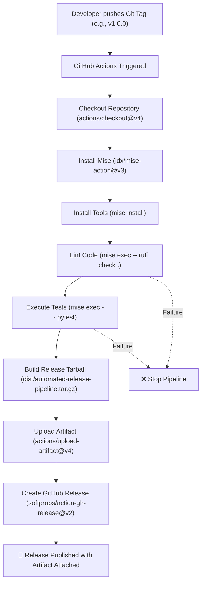

# 🚀 Automated Release Pipeline

[](https://www.python.org/)
[](https://mise.jdx.dev/)
[](https://docs.astral.sh/ruff/)
[](https://docs.pytest.org/)
[](https://github.com/features/actions)
[](https://devpod.sh/)
[](https://github.com/alanvarghese-dev/lab/releases)

An end-to-end automated Continuous Integration and Continuous Delivery (CI/CD) release pipeline for Python applications using **GitHub Actions**, **Mise**, **Pytest**, **Ruff**, and **DevPod**.

This project demonstrates how source code changes seamlessly transition from local containerized development to automated validation, artifact packaging, and published GitHub Releases triggered by Git tags.

---

## 📋 Table of Contents

- [Overview](#-overview)
- [Key Features](#-key-features)
- [Architecture & Repository Structure](#-architecture--repository-structure)
- [Tech Stack](#-tech-stack)
- [Development Environment](#-development-environment)
- [Application & Test Suite](#-application--test-suite)
- [Local Development & Verification](#-local-development--verification)
- [CI/CD Pipeline & GitHub Actions](#-cicd-pipeline--github-actions)
- [Release Process & Tagging](#-release-process--tagging)
- [Troubleshooting & Lessons Learned](#-troubleshooting--lessons-learned)
- [Future Enhancements](#-future-enhancements)

---

## 📖 Overview

The primary objective of this project is to implement a robust, production-grade automated release workflow within a monorepo / multi-project repository (`alanvarghese-dev/lab`).

### Why Automation Matters
Without automated pipelines, release engineering is error-prone and manual:
- ❌ Manually configuring local tool chains and runtime versions across machines
- ❌ Inconsistent linting and forgotten test executions
- ❌ Manual compression, packaging, and asset uploads
- ❌ Ad-hoc release notes and unversioned binaries

With this automated pipeline:
- ✅ **Deterministic tooling**: Managed via Mise for 100% parity between local dev and CI
- ✅ **Zero-defect releases**: Lint checks and unit tests act as hard quality gates
- ✅ **Automated distribution**: Compressed release tarballs (`.tar.gz`) are built and attached to GitHub Releases upon tag creation

---

## ✨ Key Features

- **Isolated Dev Environment**: Standardized containerized environment using **DevPod** with the Docker provider.
- **Unified Version Management**: Tooling, runtimes, and linters pinned declaratively in [`mise.toml`](file:///Users/iti/Documents/My%20Mac%20Docu/HOMELAB/automated-release-pipeline/mise.toml).
- **Code Quality Gates**: Fast, modern Python linting and formatting verification with **Ruff**.
- **Automated Unit Testing**: Discoverable unit tests executed via **Pytest** with configured `pythonpath`.
- **Packaging & Artifact Generation**: Automatic build of versioned distribution archives (`dist/automated-release-pipeline.tar.gz`).
- **Tag-Triggered GitHub Releases**: Releases and changelogs are dynamically created via `softprops/action-gh-release@v2` when Git tags (e.g. `v1.0.0`) are pushed.

---

## 🏗️ Architecture & Repository Structure

The project lives as a sub-project within the `alanvarghese-dev/lab` repository to allow multiple DevOps projects to coexist:

```
/workspaces/
├── .github/
│   └── workflows/
│       └── automated-release.yml      # Root CI/CD workflow definition
│
└── automated-release-pipeline/        # Subproject Directory
    ├── .devcontainer/
    │   ├── Dockerfile                 # Container image definition with Mise
    │   └── .devcontainer.json         # Dev container build specification
    ├── tests/
    │   └── test_app.py                # Pytest unit tests
    ├── app.py                         # Core application entrypoint
    ├── mise.toml                      # Tooling configuration (Python, Ruff, Pytest)
    ├── pytest.ini                     # Pytest discovery & pythonpath configuration
    ├── .gitignore                     # Ignored build, cache, and env artifacts
    └── dist/
        └── automated-release-pipeline.tar.gz  # Generated release package
```

> [!NOTE]
> The Git repository root is `/workspaces` (the monorepo root), while this project's code resides in `/workspaces/automated-release-pipeline/`. GitHub Actions workflows at the root trigger actions specifically targeting this subproject.

---

## 🛠️ Tech Stack

| Component | Technology | Purpose |
| :--- | :--- | :--- |
| **Language** | Python 3.12 | Core application runtime |
| **Environment** | DevPod / Docker | Containerized, repeatable development environment |
| **Tool Manager** | Mise (`mise.toml`) | Manages Python, pipx, pytest, and ruff versions |
| **Testing** | Pytest (`pytest.ini`) | Automated unit test execution |
| **Linter / Formatter** | Ruff | Ultra-fast Python code quality enforcement |
| **Automation Engine** | GitHub Actions | Continuous Integration and Release workflow runner |
| **Release Action** | `softprops/action-gh-release@v2` | Automated GitHub Release and asset attachment |

---

## 📦 Development Environment

### 1. DevPod / Docker Setup
Development is hosted inside an isolated DevPod container based on Ubuntu 24.04:

```dockerfile
FROM mcr.microsoft.com/devcontainers/base:ubuntu-24.04

COPY --from=jdxcode/mise /usr/local/bin/mise /usr/local/bin/

# Activate mise in bash and zsh
RUN echo 'eval "$(mise activate bash)"' >> /home/vscode/.bashrc && \
    echo 'eval "$(mise activate zsh)"' >> /home/vscode/.zshrc
```

### 2. Tooling Configuration ([`mise.toml`](file:///Users/iti/Documents/My%20Mac%20Docu/HOMELAB/automated-release-pipeline/mise.toml))
Mise coordinates tool dependencies deterministically:

```toml
[tools]
python = "3.12"
pipx = "latest"
"pipx:pytest" = "latest"
"pipx:ruff" = "latest"
```

---

## 🧪 Application & Test Suite

### Application Logic ([`app.py`](file:///Users/iti/Documents/My%20Mac%20Docu/HOMELAB/automated-release-pipeline/app.py))
A modular Python utility providing math operations:

```python
def add(a, b):
    return a + b


if __name__ == "__main__":
    print(f"2 + 3 = {add(2, 3)}")
```

### Test Suite ([`tests/test_app.py`](file:///Users/iti/Documents/My%20Mac%20Docu/HOMELAB/automated-release-pipeline/tests/test_app.py))
Unit tests verifying application functionality:

```python
from app import add


def test_add():
    assert add(2, 3) == 5


def test_add_negative_numbers():
    assert add(-2, -3) == -5
```

### Pytest Configuration ([`pytest.ini`](file:///Users/iti/Documents/My%20Mac%20Docu/HOMELAB/automated-release-pipeline/pytest.ini))
Configures test discovery and module path resolution:

```ini
[pytest]
testpaths = tests
pythonpath = .
```

---

## 💻 Local Development & Verification

Follow these steps to set up and run the project locally:

### 1. Install Project Tools
Install all runtimes and tools defined in [`mise.toml`](file:///Users/iti/Documents/My%20Mac%20Docu/HOMELAB/automated-release-pipeline/mise.toml):
```bash
mise install
```

### 2. Run the Application
```bash
mise exec -- python app.py
# Output: 2 + 3 = 5
```

### 3. Run Lint Checks
Ensure code adheres to quality standards:
```bash
mise exec -- ruff check .
```

### 4. Execute Unit Tests
Run the test suite with Pytest:
```bash
mise exec -- pytest
```

---

## 🔄 CI/CD Pipeline & GitHub Actions

The automated release workflow is configured in `.github/workflows/automated-release.yml`.

### Workflow Flowchart



### Pipeline Stages
1. **Checkout**: Checks out source code using `actions/checkout@v4`.
2. **Tool Setup**: Boots Mise in CI via `jdx/mise-action@v3` and runs `mise install`.
3. **Quality Gate (Linting)**: Executes `mise exec -- ruff check .`.
4. **Quality Gate (Testing)**: Runs `mise exec -- pytest`. Fails the pipeline if any test fails.
5. **Artifact Packaging**: Packages `app.py`, `mise.toml`, and `pytest.ini` into `dist/automated-release-pipeline.tar.gz`.
6. **Artifact Storage**: Uploads the bundle to the workflow run using `actions/upload-artifact@v4`.
7. **GitHub Release Publication**: Utilizes `contents: write` permissions and `softprops/action-gh-release@v2` to publish the release with auto-generated release notes and attached tarball.

---

## 🏷️ Release Process & Tagging

To publish a new version, follow this release checklist:

```bash
# 1. Verify tests and linting pass locally
mise exec -- ruff check .
mise exec -- pytest

# 2. Stage and commit changes
git add .
git commit -m "feat: enhance application functionality"

# 3. Push commits to main branch
git push origin main

# 4. Create an annotated release tag
git tag -a v1.0.0 -m "Release v1.0.0"

# 5. Push the tag explicitly to trigger the release pipeline
git push origin refs/tags/v1.0.0
```

> [!TIP]
> Always use `git push origin refs/tags/<tag_name>` to prevent refspec ambiguity errors during tag pushes.

---

## 🔧 Troubleshooting & Lessons Learned

| Issue / Error | Root Cause | Solution |
| :--- | :--- | :--- |
| `ModuleNotFoundError: No module named 'app'` | Pytest was executing from `tests/` directory without the project root in Python's search path. | Added `pythonpath = .` and `testpaths = tests` to [`pytest.ini`](file:///Users/iti/Documents/My%20Mac%20Docu/HOMELAB/automated-release-pipeline/pytest.ini). |
| `src refspec v1.0.0 does not match any` | Git could not resolve the local tag reference during push. | Verified local tag with `git tag`, created annotated tag with `git tag -a <tag>`, and pushed explicitly via `git push origin refs/tags/<tag>`. |
| Monorepo Path Resolution Confusion | GitHub Actions root configuration vs project subdirectory path mismatches. | Structured workflows in root `.github/workflows/` with working directories explicitly pointing to `automated-release-pipeline/`. |

---

## 📄 License & Attribution

Part of the **[alanvarghese-dev/lab](https://github.com/alanvarghese-dev/lab)** DevOps learning suite.
Developed for learning automated CI/CD and release pipeline architectures.
