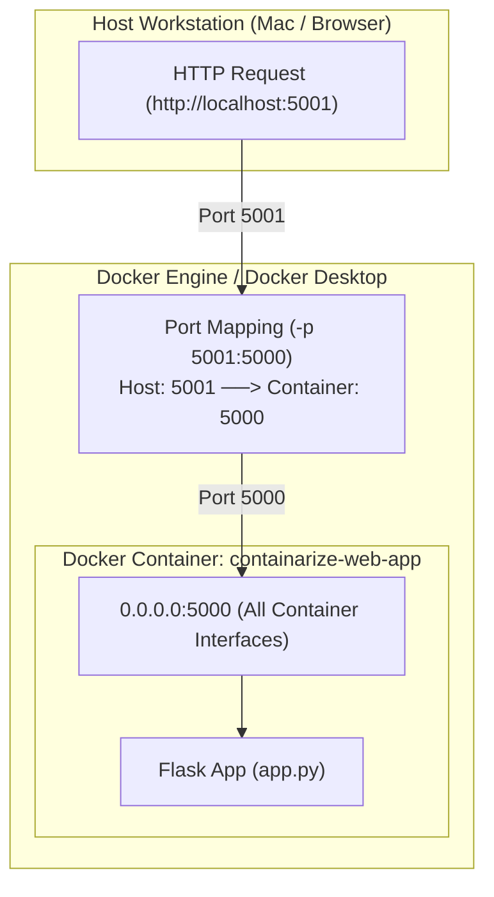
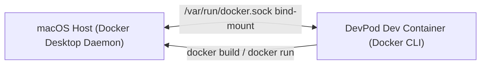

# 🐳 Containerize a Web Application


A hands-on DevOps homelab project demonstrating how to build, containerize, run, and troubleshoot a Python Flask web application using Docker inside a reproducible DevPod / Dev Container development environment.

---

## 📖 Table of Contents

- [Overview](#-overview)
- [Architecture & Network Flow](#-architecture--network-flow)
- [Project Structure](#-project-structure)
- [Prerequisites & Development Environment](#-prerequisites--development-environment)
- [Quickstart Guide](#-quickstart-guide)
  - [1. Build the Docker Image](#1-build-the-docker-image)
  - [2. Run the Container](#2-run-the-container)
  - [3. Verify & Access the Application](#3-verify--access-the-application)
- [Key Concepts & Deep Dive](#-key-concepts--deep-dive)
  - [Docker Image vs. Docker Container](#docker-image-vs-docker-container)
  - [Dockerfile Anatomy & Layer Caching](#dockerfile-anatomy--layer-caching)
  - [Container Networking: Why `0.0.0.0` Matters](#container-networking-why-0000-matters)
  - [Port Mapping Explained (`HOST_PORT:CONTAINER_PORT`)](#port-mapping-explained-host_portcontainer_port)
  - [Context Optimization with `.dockerignore`](#context-optimization-with-dockerignore)
  - [App Dockerfile vs. DevContainer Dockerfile](#app-dockerfile-vs-devcontainer-dockerfile)
- [Troubleshooting & Debugging Guide](#-troubleshooting--debugging-guide)
  - [Docker Socket & Daemon Communication inside DevPod](#1-docker-socket--daemon-communication-inside-devpod)
  - [Docker Socket Permissions](#2-docker-socket-permissions)
  - [Port Conflict (`address already in use`)](#3-port-conflict-address-already-in-use)
  - [Container Name Conflict](#4-container-name-conflict)
  - [Systematic Layered Debugging Methodology](#5-systematic-layered-debugging-methodology)
- [Useful Docker Commands Cheatsheet](#-useful-docker-commands-cheatsheet)
- [Future Enhancements & Roadmap](#-future-enhancements--roadmap)

---

## 🌟 Overview

The primary objective of this project is to take a lightweight Python Flask web service and containerize it with Docker, moving beyond simple application code to understand real-world container operations:
- Designing a multi-layered, cache-efficient [Dockerfile](Dockerfile).
- Bridging the Docker client and daemon across DevPod and Docker Desktop via Unix socket bind-mounting.
- Resolving network interfaces, port mappings, and container lifecycle events.
- Diagnosing and debugging infrastructure errors systematically.

---

## 📐 Architecture & Network Flow

The diagram below illustrates the end-to-end request flow from the host workstation (Mac/Browser) through Docker's port mapping into the isolated container and down to the Flask app:



### DevPod & Docker Daemon Integration
When developing inside DevPod, the Docker CLI connects back to Docker Desktop on macOS via the mounted Docker Unix socket:



---

## 📁 Project Structure

```text
containarize-web-app/
├── .devcontainer/
│   ├── Dockerfile            # Base image & tooling for DevPod/VS Code dev environment
│   └── devcontainer.json     # Mounts /var/run/docker.sock and defines workspace configuration
├── .dockerignore             # Excludes cache, Git metadata, and local venvs from Docker build
├── Dockerfile                # Production-style image recipe for the Flask application
├── app.py                    # Lightweight Flask web server listening on 0.0.0.0:5000
├── mise.toml                 # Toolchain versions managed by Mise (python, pipx, docker-cli)
├── requirements.txt          # Python dependencies (Flask)
├── what_i_learned.txt        # Detailed project learning journal and troubleshooting notes
└── readme.md                 # Project documentation
```

---

## 🛠️ Prerequisites & Development Environment

- **Docker Desktop** (or Docker Engine on Linux)
- **DevPod** or **VS Code Dev Containers** (optional, for running in an isolated containerized workspace)
- **Mise** (for local CLI tool management: Python, pipx, Docker CLI)
- **Curl** or a modern web browser for testing

---

## 🚀 Quickstart Guide

### 1. Build the Docker Image

From the root of the project directory, run:

```bash
docker build -t containarize-web-app .
```

- `-t containarize-web-app`: Tags the resulting Docker image with a recognizable name.
- `.`: Sets the build context to the current directory.

Verify the built image:

```bash
docker images containarize-web-app
```

### 2. Run the Container

#### Run in Detached Mode (Background)
```bash
docker run -d \
  --name containarize-web-app \
  -p 5001:5000 \
  containarize-web-app
```

#### Run in Foreground Mode (Interactive logs)
```bash
docker run \
  --name containarize-web-app \
  -p 5001:5000 \
  containarize-web-app
```

### 3. Verify & Access the Application

- **From the host terminal**:
  ```bash
  curl http://localhost:5001
  ```
  Expected output:
  ```text
  Hello from my containerized application!
  ```

- **From a web browser**:
  Navigate to [http://localhost:5001](http://localhost:5001).

- **From inside the container itself**:
  ```bash
  docker exec containarize-web-app \
    python -c "import urllib.request; print(urllib.request.urlopen('http://127.0.0.1:5000').read().decode())"
  ```

---

## 🧠 Key Concepts & Deep Dive

### Docker Image vs. Docker Container

| Concept | Description | Analogy |
| :--- | :--- | :--- |
| **Docker Image** | Read-only, immutable snapshot containing code, libraries, and runtime configuration (`containarize-web-app:latest`). | Blueprint / Class |
| **Docker Container** | Writable, running instance of an image with isolated namespaces, filesystem, and network interface. | Constructed Building / Object instance |

### Dockerfile Anatomy & Layer Caching

Our [Dockerfile](Dockerfile) leverages Docker layer caching to speed up subsequent rebuilds:

```dockerfile
# 1. Base image: Slim variant to minimize image footprint and attack surface
FROM python:3.12-slim

# 2. Set container working directory
WORKDIR /app

# 3. Copy ONLY dependencies first to leverage Docker build cache
COPY requirements.txt .

# 4. Install dependencies without caching pip wheels to reduce image size
RUN pip install --no-cache-dir -r requirements.txt

# 5. Copy application code (changes frequently, so placed after dependency install)
COPY app.py .

# 6. Document intended ingress port
EXPOSE 5000

# 7. Default process executed on container startup
CMD ["python", "app.py"]
```

> [!TIP]
> Placing `COPY requirements.txt .` and `RUN pip install ...` **before** `COPY app.py .` ensures that Docker does not re-run slow pip installations when only application code changes.

### Container Networking: Why `0.0.0.0` Matters

In [app.py](app.py):
```python
if __name__ == "__main__":
    app.run(host="0.0.0.0", port=5000)
```

- **`127.0.0.1` (localhost)**: Loops back strictly inside the container's isolated network namespace. Traffic forwarded from the host or other containers is rejected.
- **`0.0.0.0` (all interfaces)**: Instructs the application process to bind to every network interface inside the container, allowing incoming traffic from Docker's virtual bridge and port forwarder.

### Port Mapping Explained (`HOST_PORT:CONTAINER_PORT`)

```text
-p 5001:5000
    │    │
    │    └─ Container Port (where Flask listens inside the container)
    └────── Host Port (port exposed on your host machine / Mac)
```

- If host port `5000` is already in use by another process (e.g. macOS AirPlay Receiver or another server), you can change the **host port** to `5001` without altering your application or container port.

### Context Optimization with `.dockerignore`

The [.dockerignore](.dockerignore) prevents local clutter, version control data, and caches from being transferred into the Docker daemon build context:
- `.git`, `.gitignore`
- `__pycache__`, `*.pyc`, `.pytest_cache`
- `.venv`, `.env`, `.mise`

### App Dockerfile vs. DevContainer Dockerfile

- **`.devcontainer/Dockerfile`**: Configures the **development workspace** (Ubuntu 24.04, user `vscode`, Mise toolchain, shell integrations).
- **`Dockerfile`**: Packages the **production runtime image** for the Flask application (minimal `python:3.12-slim`).

---

## 🔍 Troubleshooting & Debugging Guide

### 1. Docker Socket & Daemon Communication inside DevPod
- **Symptom**: `docker info` fails with `Cannot connect to the Docker daemon at unix:///var/run/docker.sock`.
- **Root Cause**: The DevPod container did not have `/var/run/docker.sock` mounted from Docker Desktop.
- **Fix**: Mount the Docker socket in [.devcontainer/devcontainer.json](.devcontainer/devcontainer.json):
  ```json
  "mounts": [
    "source=/var/run/docker.sock,target=/var/run/docker.sock,type=bind"
  ]
  ```

### 2. Docker Socket Permissions
- **Symptom**: `permission denied while trying to connect to the Docker API` when running Docker commands as `vscode`.
- **Root Cause**: The mounted socket has `root:root` ownership and `0660` permissions.
- **Fix**: Refresh shell group membership inside the container:
  ```bash
  newgrp root
  ```

### 3. Port Conflict (`address already in use`)
- **Symptom**: `bind: address already in use` when binding to host port `5000`.
- **Fix**: Publish to an alternate host port using `-p 5001:5000`.

### 4. Container Name Conflict
- **Symptom**: `Conflict. The container name "/containarize-web-app" is already in use`.
- **Fix**: Remove the existing container before creating a new one:
  ```bash
  docker rm -f containarize-web-app
  ```

### 5. Systematic Layered Debugging Methodology

When an error occurs, isolate each layer sequentially rather than changing multiple variables at once:

```text
1. Application Layer   ──> Does Python/Flask run locally?
2. Container Layer     ──> Did the container start? (docker ps -a, docker logs)
3. Container Port      ──> Is Flask listening on 0.0.0.0:5000 inside the container?
4. Port Forwarding     ──> Is HOST_PORT:CONTAINER_PORT properly mapped?
5. DevPod / Daemon     ──> Is the Docker socket accessible with proper permissions?
6. Host Reachability   ──> Can curl or the browser connect to localhost:HOST_PORT?
```

---

## 🧰 Useful Docker Commands Cheatsheet

| Task | Command |
| :--- | :--- |
| Build an image | `docker build -t containarize-web-app .` |
| List local images | `docker images` |
| Run container in background | `docker run -d --name containarize-web-app -p 5001:5000 containarize-web-app` |
| List running containers | `docker ps` |
| List all containers (including exited) | `docker ps -a` |
| Stream container logs | `docker logs -f containarize-web-app` |
| Inspect container metadata & networking | `docker inspect containarize-web-app` |
| Execute command inside container | `docker exec -it containarize-web-app sh` |
| Stop container | `docker stop containarize-web-app` |
| Remove container | `docker rm -f containarize-web-app` |
| Check Docker daemon connection | `docker info` |

---
