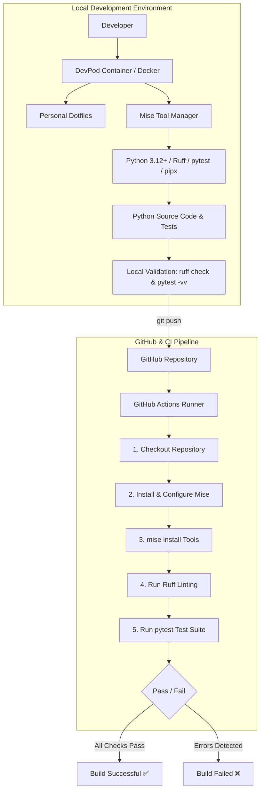

# GitHub Actions CI Pipeline with DevPod & Mise

[](https://www.python.org/)
[](https://devpod.sh/)
[](https://mise.jdx.dev/)
[](https://docs.astral.sh/ruff/)
[](https://docs.pytest.org/)
[](https://github.com/features/actions)

A complete, production-ready Continuous Integration (CI) demonstration project. This repository illustrates how to build a robust Python CI pipeline using **GitHub Actions**, with an isolated local development environment powered by **DevPod (Docker provider)**, tool versioning via **Mise**, automated code formatting/linting with **Ruff**, and comprehensive unit testing with **pytest**.

---

## 📑 Table of Contents

- [Overview](#-overview)
- [Architecture & Workflow](#-architecture--workflow)
- [Tech Stack](#-tech-stack)
- [Project Structure](#-project-structure)
- [Local Development Setup](#-local-development-setup)
- [Running Tests & Quality Checks](#-running-tests--quality-checks)
- [CI/CD Pipeline (GitHub Actions)](#-cicd-pipeline-github-actions)
- [Key Troubleshooting & Errors Solved](#-key-troubleshooting--errors-solved)
- [Systematic Troubleshooting Method](#-systematic-troubleshooting-method)
- [Best Practices & Lessons Learned](#-best-practices--lessons-learned)
- [References & Documentation](#-references--documentation)

---

## 🎯 Overview

The primary goal of this project is to create an end-to-end reproducible developer experience and automated CI validation:

1. **Reproducible Development**: Develop inside a containerized DevPod environment using personal dotfiles and declarative tool management via Mise.
2. **Deterministic Tooling**: Ensure tool versions (Python, Ruff, pytest, pipx) are declared in `mise.toml` rather than depending on host-installed dependencies.
3. **Automated Quality Gates**: Automatically run linting (`ruff`) and unit tests (`pytest`) upon every push.
4. **Monorepo / Multi-Project Integration**: Configure GitHub Actions to properly target nested project directories with dedicated working directories.
5. **Validated Failure Handling**: Prove CI reliability through intentional failure injection and recovery.

---

## 🏗 Architecture & Workflow

### 1. Development & CI Lifecycle



### 2. Separation of Concerns

| Layer | Responsibility | Managed Files |
|---|---|---|
| **Dotfiles** | Developer ergonomics, shell themes, editor preferences | `.zshrc`, `.bashrc`, personal CLI config |
| **Dev Container** | Operating system base, containerized runtime | `Dockerfile`, `.devcontainer.json` |
| **Mise** | Language versions, linters, test runner binaries | `mise.toml` |
| **Application** | Core business logic and test implementations | `src/`, `tests/`, `pytest.ini` |
| **CI / CD** | Automated verification and pipeline orchestration | `.github/workflows/github-actions-ci.yml` |

---

## 🛠 Tech Stack

- **Container Engine**: [Docker](https://www.docker.com/) via [DevPod](https://devpod.sh/) (`Ubuntu 24.04` base)
- **Tool Version Manager**: [Mise](https://mise.jdx.dev/) (`mise.toml`)
- **Programming Language**: [Python 3.12+](https://www.python.org/)
- **Linter & Formatter**: [Ruff](https://docs.astral.sh/ruff/)
- **Test Framework**: [pytest](https://docs.pytest.org/)
- **Package Runner**: [pipx](https://pypa.github.io/pipx/)
- **Continuous Integration**: [GitHub Actions](https://github.com/features/actions)

---

## 📂 Project Structure

```text
github-actions-devpod-ci/
├── .devcontainer.json         # DevPod / VS Code Dev Container configuration
├── Dockerfile                 # Dev container image definition with Mise
├── .gitignore                 # Python, test cache, and environment ignores
├── mise.toml                  # Declarative tool specifications (Python, Ruff, pytest)
├── pytest.ini                 # pytest path configuration (pythonpath = .)
├── README.md                  # Project documentation (this file)
├── errors.md                  # Comprehensive troubleshooting log & learnings
├── src/                       # Application source code
│   ├── __init__.py
│   └── main.py                # Core calculator module
└── tests/                     # Automated test suite
    └── test_main.py           # Unit tests for calculator module
```

In a monorepo / multi-project repository setup (e.g. `lab/`):

```text
lab/
├── .github/
│   └── workflows/
│       └── github-actions-ci.yml   # Workflow located at repository root
├── jenkins-pipeline/               # Sibling pipeline project
└── github-actions-devpod-ci/       # This project directory
```

---

## 🚀 Local Development Setup

### Prerequisites

- [Docker](https://docs.docker.com/get-docker/) installed and running
- [DevPod](https://devpod.sh/) installed (or VS Code Remote - Containers)
- [Git](https://git-scm.com/)

### 1. Launch Environment with DevPod

Launch the project inside DevPod using the Docker provider:

```bash
devpod up . --provider docker
```

DevPod will build the container using the provided `Dockerfile` and configure your environment with Mise activated.

### 2. Install Project Tools via Mise

Inside the development container, install the declared tools:

```bash
# Verify mise is active
mise --version

# Install all tools declared in mise.toml
mise install

# Inspect installed tool versions
mise ls
```

### 3. Run the Application

```bash
python src/main.py
```

---

## 🧪 Running Tests & Quality Checks

Always run quality checks locally before committing or pushing changes.

### 1. Code Linting & Formatting (Ruff)

```bash
# Check code quality and imports
ruff check .

# Automatically apply safe fixes (e.g. import sorting, unused variables)
ruff check . --fix
```

### 2. Unit Testing (pytest)

```bash
# Run the test suite with verbose output
pytest -vv

# Run only collection to inspect detected tests
pytest --collect-only -vv
```

### 3. Manual Import & Sanity Verification

```bash
python -c "from src.main import add, subtract, multiply, divide; print('Sanity check add(2, 3) =', add(2, 3))"
```

---

## ⚙️ CI/CD Pipeline (GitHub Actions)

### Workflow Definition

The CI pipeline runs automatically on `push` and `pull_request` events against `main`. 

In a multi-project setup, the workflow file resides at `.github/workflows/github-actions-ci.yml` at the repository root and targets the `github-actions-devpod-ci` directory using `defaults.run.working-directory`:

```yaml
name: GitHub Actions DevPod CI

on:
  push:
    branches: [ main ]
  pull_request:
    branches: [ main ]

jobs:
  ci-pipeline:
    runs-on: ubuntu-latest

    defaults:
      run:
        working-directory: github-actions-devpod-ci

    steps:
      - name: Checkout repository
        uses: actions/checkout@v4

      - name: Install Mise
        uses: jdx/mise-action@v2
        with:
          version: latest
          install: false

      - name: Install Project Tools
        run: mise install

      - name: Run Ruff Linting
        run: mise exec -- ruff check .

      - name: Run pytest Test Suite
        run: mise exec -- pytest -vv
```

### Pipeline Execution Flow

```text
[Trigger: Push to main]
       │
       ▼
┌───────────────────────────────┐
│  Job: ci-pipeline             │
│  ├─ 1. Checkout repository    │ ──> PASS
│  ├─ 2. Setup Mise Action      │ ──> PASS
│  ├─ 3. mise install           │ ──> PASS (Python, Ruff, pytest)
│  ├─ 4. ruff check .           │ ──> PASS (Lint & Style valid)
│  └─ 5. pytest -vv             │ ──> PASS (5/5 tests passed)
└───────────────────────────────┘
       │
       ▼
[Status: SUCCESS ✅]
```

---

## 🔍 Key Troubleshooting & Errors Solved

During development and pipeline setup, several real-world issues were identified, diagnosed, and resolved. Full details are recorded in [`errors.md`](file:///Users/iti/Documents/My%20Mac%20Docu/HOMELAB/github-actions-devpod-ci/errors.md).

### 1. `pytest` Command Missing
* **Symptom**: Running `pytest` returned `command not found`.
* **Root Cause**: `pytest` was assumed to exist rather than being explicitly declared in `mise.toml`.
* **Solution**: Added `"pipx:pytest" = "latest"` to `mise.toml` and ran `mise install`.

### 2. `No module named pytest` vs `which pytest`
* **Symptom**: `which pytest` resolved an executable, but invoking it through certain Python contexts failed with `No module named pytest`.
* **Root Cause**: Executables provided via CLI runners (`pipx`) and Python interpreter runtimes can come from different environments.
* **Solution**: Standardized direct CLI invocation (`pytest -vv` / `mise exec -- pytest`) using the Mise-managed toolset.

### 3. `ModuleNotFoundError: No module named 'src'`
* **Symptom**: `test_main.py` failed on `from src.main import add...` when running `pytest`.
* **Root Cause**: The project root was not automatically included in Python's `sys.path` during test discovery.
* **Bad Workaround (Avoid)**: Copying `src/` inside `tests/` (violates single source of truth).
* **Correct Solution**: Added `pytest.ini` with:
  ```ini
  [pytest]
  pythonpath = .
  ```

### 4. Incorrect Relative Imports (`from .src.main import ...`)
* **Symptom**: `ModuleNotFoundError: No module named 'tests.src'`.
* **Root Cause**: Prefixing `.` caused Python to look for a relative submodule inside the `tests` package.
* **Solution**: Use absolute project imports: `from src.main import add, subtract, multiply, divide`.

### 5. Ruff Import Sorting & Formatting
* **Symptom**: Ruff flagged import block formatting errors.
* **Solution**: Used automated fix capabilities: `ruff check . --fix`.

### 6. Git "No commits yet" in Monorepo Context
* **Symptom**: `git status` showed `No commits yet` while remote already possessed history.
* **Solution**: Diagnosed using `git remote -v` and `git log --oneline --all`, followed by `git fetch origin`, `git reset origin/main`, and `git restore` to synchronize without destroying `.git`.

### 7. GitHub Actions Workflow Discovery in Monorepos
* **Symptom**: GitHub Actions did not trigger when `ci.yml` was located in `github-actions-devpod-ci/.github/workflows/`.
* **Root Cause**: GitHub only scans the root `.github/workflows/` directory.
* **Solution**: Placed the workflow at `lab/.github/workflows/github-actions-ci.yml` and specified `defaults.run.working-directory: github-actions-devpod-ci`.

### 8. Verification by Intentional Failure Injection
* **Validation**: Added a deliberately failing test (`assert add(2, 2) == 5`) and pushed to GitHub.
* **Result**: GitHub Actions properly failed at step `Run pytest`, proving the quality gate is functional and not a false-positive pass.

---

## 🧭 Systematic Troubleshooting Method

When diagnosing issues in containerized and CI environments, follow this 10-step protocol:

```text
 1. Read the full error message and stack trace.
 2. Identify the exact command and working directory that failed.
 3. Determine the affected layer (Host, Docker, DevPod, Mise, Python, Git, CI).
 4. Verify binary paths (`which <tool>`, `mise which <tool>`).
 5. Check tool and runtime versions (`<tool> --version`, `python --version`).
 6. Isolate and test the smallest unit (e.g. `python -c "from src.main import ..."`).
 7. Make exactly ONE change at a time.
 8. Re-run the command under the same conditions.
 9. Confirm the fix without introducing architectural compromises.
10. Proceed only after the root cause is resolved and verified.
```

---

## 💡 Best Practices & Lessons Learned

1. **Explicit Over Implicit**: Always declare tools and dependencies in configuration files (`mise.toml`, `Dockerfile`) rather than assuming host availability.
2. **Preserve Architecture**: Never use "quick hacks" (like duplicating code into test directories) that compromise structural integrity.
3. **Decouple Dotfiles from Project Config**: Dotfiles belong to the developer; project requirements belong to the repo.
4. **Test Locally Before CI**: Always verify `ruff check .` and `pytest -vv` locally before pushing commits.
5. **Verify Failure Modes**: A CI pipeline is only proven reliable when it has been observed failing on bad code and passing on good code.
6. **Mind Monorepo Pathing**: Distinguish between workflow file location (`.github/workflows/`) and task execution directory (`working-directory`).

---

## 📚 References & Documentation

- [Mise Documentation](https://mise.jdx.dev/)
- [DevPod Documentation](https://devpod.sh/docs/)
- [Ruff Documentation](https://docs.astral.sh/ruff/)
- [pytest Documentation](https://docs.pytest.org/en/stable/)
- [GitHub Actions Documentation](https://docs.github.com/en/actions)

