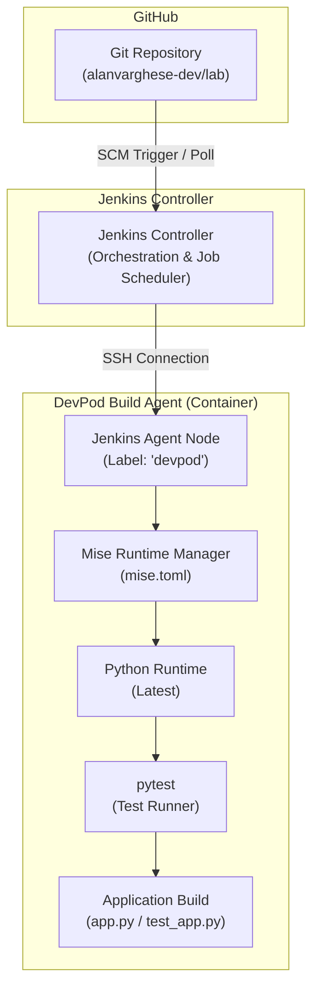
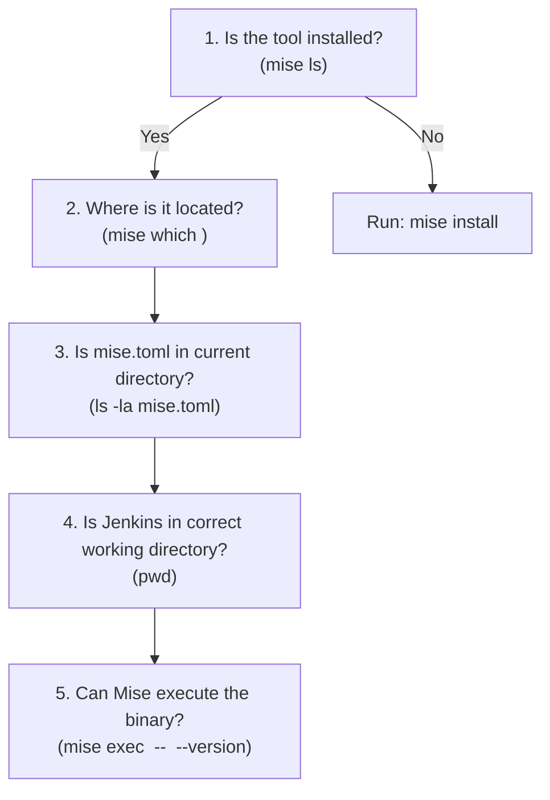

# 🚀 Jenkins + DevPod CI Pipeline Lab

A containerized Continuous Integration (CI) lab demonstrating how **Jenkins** orchestrates builds on an ephemeral, reproducible **DevPod agent** connected via SSH, utilizing **Mise** for polyglot runtime tool management.

---

## 📌 Architecture Overview

In this setup, the Jenkins Controller acts purely as the orchestrator, delegating build execution to an isolated DevPod container agent over SSH. Runtimes and dependencies are managed declaratively using Mise and Devcontainers.



### Complete CI Flow

```text
GitHub (alanvarghese-dev/lab/jenkins-pipeline)
   ↓
Jenkins Controller (Orchestrates Job)
   ↓ [SSH]
DevPod Jenkins Agent (Label: 'devpod')
   ↓
Mise (Loads toolchain from mise.toml)
   ↓
Python & pip (Installs requirements.txt)
   ↓
pytest (Executes test suite)
   ↓
Build Status: SUCCESS ✅
```

---

## 🛠️ Tech Stack & Components

| Component | Technology | Role |
| :--- | :--- | :--- |
| **CI Orchestrator** | [Jenkins](https://www.jenkins.io/) | Job orchestration, pipeline execution, stage management |
| **Build Agent** | [DevPod](https://devpod.sh/) / Docker | Isolated, reproducible containerized build agent |
| **Agent Base Image** | `mcr.microsoft.com/devcontainers/base:ubuntu-24.04` | Base OS environment for the agent container |
| **Tool Version Manager** | [Mise](https://mise.jdx.dev/) | Declarative polyglot runtime management (Java, Python, Node, Jenkins CLI) |
| **Application Runtime** | Python 3 | Simple application logic (`app.py`) |
| **Testing Framework** | `pytest` | Unit testing & assertions (`test_app.py`) |
| **Protocol** | SSH | Secure controller-to-agent communication |

---

## 📂 Project Structure

```text
jenkins-pipeline/
├── .devcontainer.json                         # Devcontainer build & context configuration
├── Dockerfile                                 # DevPod agent image definition (Mise pre-installed)
├── Jenkinsfile                                # Declarative Jenkins pipeline definition
├── mise.toml                                  # Tool versioning config (Python, Java 21, Node, Jenkins CLI)
├── app.py                                     # Python application code
├── test_app.py                                # Pytest test suite
├── requirements.txt                           # Python package dependencies
├── jenkins-devpod-things-learned-and-errors.md# Comprehensive lab notes & debugging logs
└── README.md                                  # Project documentation
```

---

## ⚙️ How It Works

### 1. Devcontainer & DevPod Agent (`Dockerfile`, `.devcontainer.json`)
The DevPod agent is built from an Ubuntu 24.04 base container with `mise` binary copied directly from the official Mise image:
```dockerfile
FROM mcr.microsoft.com/devcontainers/base:ubuntu-24.04
COPY --from=jdxcode/mise /usr/local/bin/mise /usr/local/bin/

RUN echo 'eval "$(mise activate bash)"' >> /home/vscode/.bashrc && \
    echo 'eval "$(mise activate zsh)"' >> /home/vscode/.zshrc
```

### 2. Runtime Versioning (`mise.toml`)
Tools are declared in `mise.toml`. This ensures deterministic versions across both local dev containers and CI runners:
```toml
[tools]
"aqua:jenkins-zh/jenkins-cli" = "latest"
python = "latest"
java = "21"
node = "latest"
```

### 3. Declarative Jenkinsfile (`Jenkinsfile`)
The pipeline runs on any agent labeled `devpod`. To support monorepo structures (e.g., `lab/jenkins-pipeline`), each step navigates into the project directory using `dir('jenkins-pipeline')` and invokes tools reliably via `mise exec`:

```groovy
pipeline {
    agent {
        label 'devpod'
    }

    stages {
        stage('Checkout') {
            steps {
                checkout scm
            }
        }

        stage('Setup Python') {
            steps {
                dir('jenkins-pipeline') {
                    sh '''
                        set -e
                        echo "Project directory:" && pwd
                        echo "Mise configuration:" && ls -la mise.toml
                        mise install
                        echo "Python version:"
                        mise exec python -- python --version
                    '''
                }
            }
        }

        stage('Install Dependencies') {
            steps {
                dir('jenkins-pipeline') {
                    sh '''
                        set -e
                        mise exec python -- python -m pip install -r requirements.txt
                    '''
                }
            }
        }

        stage('Test') {
            steps {
                dir('jenkins-pipeline') {
                    sh '''
                        set -e
                        mise exec python -- python -m pytest
                    '''
                }
            }
        }
    }

    post {
        success { echo 'Python CI build successful!' }
        failure { echo 'Python CI build failed!' }
    }
}
```

---

## 🧪 Application & Tests

### Application (`app.py`)
```python
def hello():
    return "Hello from Jenkins + Devpod!"

if __name__ == "__main__":
    print(hello())
```

### Tests (`test_app.py`)
```python
from app import hello 

def test_hello():
    assert hello() == "Hello from Jenkins + Devpod!"
```

---

## 💡 Key Architectural Insights & Lessons Learned

### 1. Controller vs. Agent Roles
* **Jenkins Controller**: Manages the scheduler, web UI, credentials, and pipeline orchestration.
* **Jenkins Agent**: Executes the build steps inside an isolated container. Separating these ensures Controller stability and secure, ephemeral execution.

### 2. Interactive Shell vs. Non-Interactive CI Shell
* In an interactive terminal session (`devpod ssh`), `.zshrc` / `.bashrc` loads your dotfiles and activates Mise.
* Jenkins executes non-login, non-interactive `/bin/sh` scripts that do not automatically source interactive startup files.
* **Solution**: Use `mise exec <tool> -- <command>` directly in pipeline steps rather than relying on `eval "$(mise activate ...)"` in shell startup scripts.

### 3. Monorepo Working Directory Awareness
* When storing multiple projects inside a monorepo (such as `lab/jenkins-pipeline`), Jenkins checks out at the repository root.
* Mise resolves `mise.toml` relative to the current working directory.
* **Solution**: Wrap pipeline steps in `dir('jenkins-pipeline') { ... }` so Mise finds `mise.toml` and locates the correct runtimes.

---

## 🔍 Troubleshooting Checklist

When Jenkins fails to find or execute a tool, verify in this exact order:



1. **Is the tool installed?**
   ```bash
   mise ls
   ```
2. **Where is the tool installed?**
   ```bash
   mise which python
   mise which java
   mise which node
   ```
3. **Is the project configuration present?**
   ```bash
   ls -la mise.toml
   ```
4. **Is Jenkins in the correct directory?**
   ```bash
   pwd
   ```
5. **Can Mise execute the tool?**
   ```bash
   mise exec python -- python --version
   mise exec node -- node --version
   mise exec java -- java --version
   ```

---

## 🚦 Common Errors & Resolutions

| Issue / Error | Root Cause | Resolution |
| :--- | :--- | :--- |
| **`java: command not found`** | Java installed under user profile, but not in Jenkins PATH / non-interactive environment. | Execute via `mise exec` or verify Mise environment setup. |
| **`python is installed but not activated`** | `mise.toml` was missing from the working directory because Jenkins executed from the repo root. | Wrap pipeline steps in `dir('jenkins-pipeline')` and run `mise install`. |
| **`Syntax error: "(" unexpected`** | Jenkins `/bin/sh` failed trying to execute Bash/Zsh syntax `eval "$(mise activate bash)"`. | Replace shell evaluation with explicit `mise exec python -- <cmd>` calls. |
| **`No nodes with label 'devpod'`** | Jenkins agent node label mismatch or agent offline. | Verify SSH agent connection status and ensure node label matches `devpod`. |
| **`does not have a commit checked out`** | Git commands executed from `/workspaces` instead of `/workspaces/jenkins-pipeline`. | Ensure working directory matches Git repository root (`pwd`, `git status`). |

---

## 🗺️ Lab Roadmap

This project forms the baseline CI pipeline module within the broader homelab DevOps repository (`alanvarghese-dev/lab`):

```text
lab/
├── jenkins-pipeline/    # ✅ Jenkins + DevPod SSH CI Pipeline (Current)
├── docker/              # 🔜 Containerization & Multi-stage builds
├── kubernetes/          # 🔜 K8s manifests & deployment controllers
├── terraform/           # 🔜 Infrastructure as Code (IaC)
└── gitops/              # 🔜 ArgoCD / Flux GitOps automation
```

---

## 📄 License

This lab project is maintained as part of personal DevOps homelab research and experimentation. Feel free to use and adapt!
