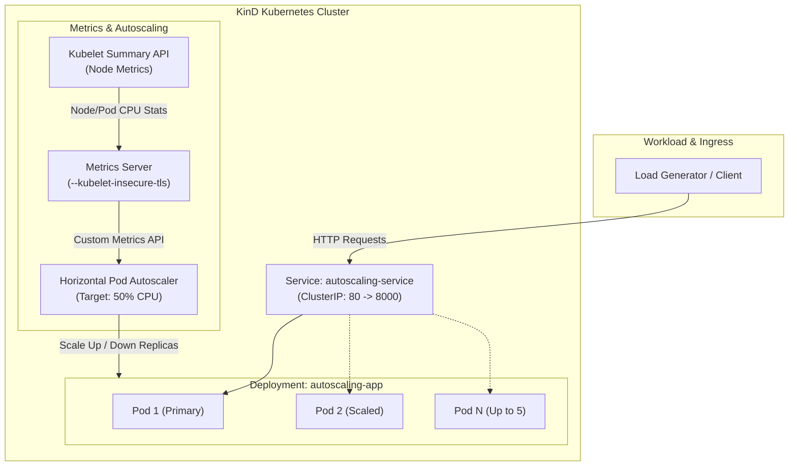

# Kubernetes Horizontal Pod Autoscaler (HPA) Setup with KinD

[](https://kubernetes.io/)
[](https://kind.sigs.k8s.io/)
[](https://www.python.org/)
[](https://www.docker.com/)

A hands-on, reproducible local Kubernetes environment demonstrating **Horizontal Pod Autoscaling (HPA)** based on real-time CPU utilization metrics. Built on top of **KinD (Kubernetes in Docker)**, this setup deploys a lightweight Python HTTP application, configures Kubernetes Metrics Server, and automatically scales workloads from 1 to 5 replicas during traffic surges.

---

## Architecture Overview



### How Autoscaling Works
1. **Traffic & CPU Ingestion:** Incoming traffic increases container CPU consumption.
2. **Metrics Collection:** The Kubernetes `metrics-server` scrapes resource statistics directly from the Kubelet.
3. **HPA Decision Cycle:** The Horizontal Pod Autoscaler compares actual CPU usage against the pod's configured resource request (`100m`).
4. **Automated Scaling:** If average CPU utilization exceeds the target threshold (`50%`), the HPA scales the deployment up (maximum 5 replicas). When traffic subsides, HPA scales the deployment back down to 1 replica after the stabilization window.

---

## Project Structure

```text
.
├── .devcontainer/              # Dev container configuration (Docker-in-Docker / DevPod ready)
│   ├── devcontainer.json       # Devcontainer mounts and build settings
│   └── Dockerfile              # Ubuntu 24.04 dev base image with mise support
├── k8s/                        # Kubernetes manifests
│   ├── deployment.yaml         # App deployment with health probes and resource limits
│   ├── hpa.yaml                # HorizontalPodAutoscaler definition (1-5 replicas, 50% CPU)
│   └── service.yaml            # ClusterIP service exposing port 80 -> 8000
├── app.py                      # Lightweight Python HTTP server with /health endpoint
├── Dockerfile                  # Slim container definition for the application
├── kind-config.yaml            # KinD cluster configuration with host.docker.internal SANs
├── mise.toml                   # Local toolchain management (kind, kubectl, docker, ruff)
└── README.md                   # Project documentation
```

---

## Prerequisites

Ensure the following tools are installed on your host machine or dev environment:

- **Docker Desktop** (or Docker Engine)
- **[KinD](https://kind.sigs.k8s.io/)** (Kubernetes in Docker)
- **[kubectl](https://kubernetes.io/docs/tasks/tools/)**
- **[Python 3.12+](https://www.python.org/)** (optional, for local testing)
- *(Optional)* **[mise](https://mise.jdx.dev/)** tool manager (`mise install` automatically sets up `kubectl`, `kind`, and `docker-cli`).

---

## Step-by-Step Setup Guide

### 1. Create the KinD Cluster

Create a local cluster using the provided [kind-config.yaml](kind-config.yaml).

```bash
kind create cluster --name autoscaling-demo --config kind-config.yaml
```

> [!NOTE]
> The [kind-config.yaml](kind-config.yaml) adds `host.docker.internal` to the API server certificate Subject Alternative Names (`certSANs`). This ensures seamless TLS authentication if accessing the cluster from inside devcontainers, DevPod, or virtual environments.

Verify cluster access:

```bash
kubectl cluster-info --context kind-demo
```

---

### 2. Deploy Metrics Server

The Horizontal Pod Autoscaler requires the Kubernetes Metrics Server to fetch CPU metrics from pods. Because KinD uses self-signed certificates on Kubelets, Metrics Server must be configured to bypass TLS validation for node scraping.

Apply the official Metrics Server manifest:

```bash
kubectl apply -f https://github.com/kubernetes-sigs/metrics-server/releases/latest/download/components.yaml
```

Patch Metrics Server to enable `--kubelet-insecure-tls`:

```bash
kubectl patch -n kube-system deployment metrics-server --type='json' -p='[
  {"op": "add", "path": "/spec/template/spec/containers/0/args/-", "value": "--kubelet-insecure-tls"}
]'
```

Verify that Metrics Server is running and scraping metrics:

```bash
kubectl rollout status -n kube-system deployment metrics-server
kubectl top nodes
```

---

### 3. Build & Load the Application Image

Build the container image locally:

```bash
docker build -t kubernetes-autoscaling:1.0 .
```

Load the image directly into the KinD cluster nodes:

```bash
kind load docker-image kubernetes-autoscaling:1.0 --name autoscaling-demo
```

> [!IMPORTANT]
> Because the image is built locally, it must be loaded into the KinD node before deploying. In [k8s/deployment.yaml](k8s/deployment.yaml), `imagePullPolicy: IfNotPresent` ensures Kubernetes uses the pre-loaded image instead of trying to pull from a remote registry.

---

### 4. Deploy Kubernetes Manifests

Apply the deployment, service, and horizontal pod autoscaler:

```bash
kubectl apply -f k8s/
```

Verify the deployed resources:

```bash
kubectl get deployments,services,hpa
```

Check initial HPA status:

```bash
kubectl get hpa autoscaling-app
```

Output should show the target and current utilization once metrics collection begins:

```text
NAME              REFERENCE                    TARGETS   MINPODS   MAXPODS   REPLICAS   AGE
autoscaling-app   Deployment/autoscaling-app   0%/50%    1         5         1          1m
```

---

## Testing Autoscaling Under Load

### 1. Monitor HPA in Real Time

In a separate terminal, open a watch on the HPA and pods:

```bash
kubectl get hpa autoscaling-app -w
```

You can also watch the pods scaling:

```bash
kubectl get pods -l app=autoscaling-app -w
```

### 2. Generate Workload Traffic

Run a temporary generator pod inside the cluster to send continuous HTTP requests to the `autoscaling-service`:

```bash
kubectl run -i --tty load-generator --rm --image=busybox:1.28 --restart=Never -- /bin/sh -c "while true; do wget -q -O- http://autoscaling-service; done"
```

### 3. Observe Scale Up

As CPU usage surges past 50%, the HPA will trigger scale-up events:

```text
NAME              REFERENCE                    TARGETS    MINPODS   MAXPODS   REPLICAS   AGE
autoscaling-app   Deployment/autoscaling-app   0%/50%     1         5         1          2m
autoscaling-app   Deployment/autoscaling-app   84%/50%    1         5         2          3m
autoscaling-app   Deployment/autoscaling-app   120%/50%   1         5         4          4m
autoscaling-app   Deployment/autoscaling-app   62%/50%    1         5         5          5m
```

Check the active pods:

```bash
kubectl get pods -l app=autoscaling-app
```

### 4. Observe Scale Down

Stop the load generator by pressing `Ctrl + C`.

After the stabilization window (defaulting to 5 minutes in Kubernetes HPA to prevent flapping), HPA will scale the replicas back down to the baseline:

```bash
kubectl get hpa autoscaling-app
```

```text
NAME              REFERENCE                    TARGETS   MINPODS   MAXPODS   REPLICAS
autoscaling-app   Deployment/autoscaling-app   0%/50%    1         5         1
```

---

## Core Concepts & Implementation Details

| Feature | Implementation | Description |
| :--- | :--- | :--- |
| **Resource Requests & Limits** | `requests.cpu: 100m`<br>`limits.cpu: 500m` | Mandatory for HPA. The HPA calculates target utilization percentages against the **CPU request**, not the limit. |
| **Health Probes** | `/health` endpoint | **Readiness Probe:** Ensures traffic is routed only after the HTTP listener is ready.<br>**Liveness Probe:** Restarts the container if the process becomes unresponsive. |
| **Service Decoupling** | `ClusterIP` Service on port 80 | Provides a single stable virtual IP and DNS name (`autoscaling-service`) across pod scale-up and scale-down cycles. |
| **DevContainer Compatibility** | `host.docker.internal` SANs | Permits accessing the control plane securely from inside containers without certificate validation failures. |

---

## Troubleshooting Guide

### 1. HPA Metrics Show `<unknown>/50%`

- **Cause:** Metrics Server is not installed, not healthy, or cannot communicate with the node kubelet.
- **Diagnostics:**
  ```bash
  kubectl get deployment metrics-server -n kube-system
  kubectl top pods
  kubectl describe hpa autoscaling-app
  ```
- **Fix:** Ensure `--kubelet-insecure-tls` argument is passed to `metrics-server` container in `kube-system`.

### 2. Dev Container / DevPod API Server Connection Refused

- **Cause:** `127.0.0.1` inside a container routes to the container itself rather than the Docker host.
- **Fix:** Point the Kubernetes server endpoint in your kubeconfig to `https://host.docker.internal:<port>` and ensure `kind-config.yaml` was initialized with `certSANs: [host.docker.internal]`.

### 3. Pods Stuck in `ImagePullBackOff` or `ErrImagePull`

- **Cause:** The image was built on the local host Docker daemon but was not loaded into the KinD node.
- **Fix:**
  ```bash
  kind load docker-image kubernetes-autoscaling:1.0 --name autoscaling-demo
  ```
  Ensure `imagePullPolicy: IfNotPresent` is defined in [k8s/deployment.yaml](k8s/deployment.yaml).

### 4. Pods Not Ready / Traffic Routing Failed

- **Diagnostics:**
  ```bash
  kubectl get pods
  kubectl describe pod <pod-name>
  kubectl logs <pod-name>
  ```
- **Check:** Verify that the `/health` endpoint returns an HTTP 200 status code on container port 8000.

---

## Cleanup

To tear down the cluster and clean up all resources:

```bash
kind delete cluster --name autoscaling-demo
```
