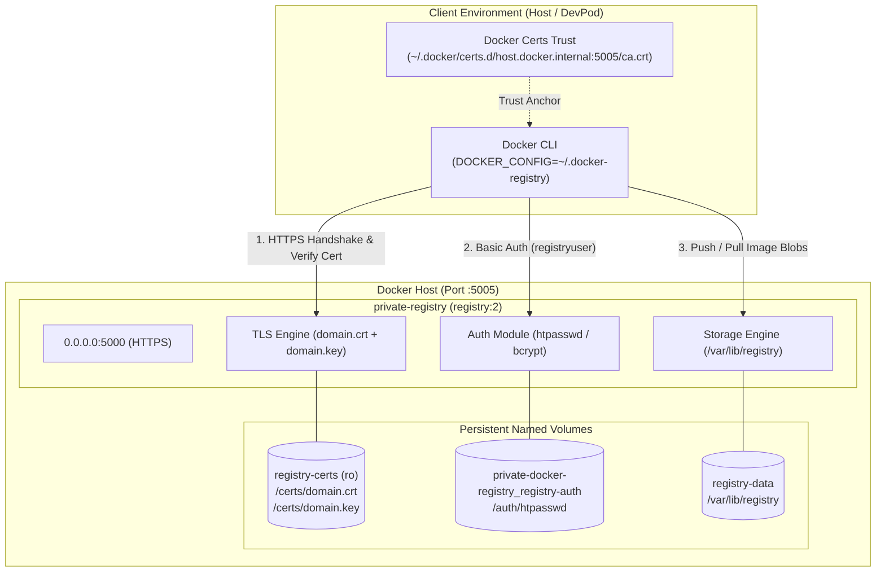

# Private Docker Registry (Homelab)

[](https://hub.docker.com/_/registry)
[](https://docs.docker.com/compose/)
[](https://docs.docker.com/registry/deploying/)
[](https://containers.dev/)

A secure, standalone private Docker Registry (v2) configured with HTTPS (TLS), basic authentication (`htpasswd`), persistent Docker named volumes, and integration with containerized development environments (DevPod / VS Code Dev Containers) on macOS with Docker Desktop.

---

## Table of Contents

- [Overview & Architecture](#overview--architecture)
- [Key Features](#key-features)
- [Project Directory Structure](#project-directory-structure)
- [Prerequisites](#prerequisites)
- [Step-by-Step Setup Guide](#step-by-step-setup-guide)
  - [1. Configure Environment Secrets](#1-configure-environment-secrets)
  - [2. Generate TLS Certificates (with SANs)](#2-generate-tls-certificates-with-sans)
  - [3. Configure Docker Daemon Trust](#3-configure-docker-daemon-trust)
  - [4. Setup HTTP Authentication (`htpasswd`)](#4-setup-http-authentication-htpasswd)
  - [5. Provision Docker Named Volumes](#5-provision-docker-named-volumes)
  - [6. Start the Registry](#6-start-the-registry)
- [End-to-End Workflow](#end-to-end-workflow)
  - [Authenticate (`docker login`)](#authenticate-docker-login)
  - [Build and Tag Test Image](#build-and-tag-test-image)
  - [Push to Private Registry](#push-to-private-registry)
  - [Inspect Registry Catalog](#inspect-registry-catalog)
  - [Pull and Run](#pull-and-run)
- [Troubleshooting & Lessons Learned](#troubleshooting--lessons-learned)
- [DevContainer & Tooling (`mise`)](#devcontainer--tooling-mise)
- [Maintenance & Useful Commands](#maintenance--useful-commands)
- [Security Best Practices](#security-best-practices)

---

## Overview & Architecture

Running a private Docker Registry locally inside or alongside development environments (like DevPod or Docker Desktop on macOS) introduces subtle networking, certificate verification, and filesystem sharing nuances.

This project deploys an official Docker Registry v2 container that:
1. Exposes an HTTPS endpoint on port `5005` (mapped to internal port `5000`).
2. Enforces basic authentication with bcrypt-hashed credentials stored in an `htpasswd` volume.
3. Secures HTTP operations and token generation using `REGISTRY_HTTP_SECRET`.
4. Utilizes Docker-managed named volumes instead of host bind mounts to bypass macOS/DevPod filesystem permission and path-sharing limitations.
5. Communicates cleanly across containers and host using `host.docker.internal`.



---

## Key Features

- **TLS / HTTPS Enabled:** Encrypted communication using self-signed x509 certificates with Subject Alternative Names (SAN) for `host.docker.internal` and `localhost`.
- **Basic Authentication (`htpasswd`):** Restricts push/pull access to authorized users via bcrypt/apr1 hashed credentials.
- **State & Token Integrity:** Secure `REGISTRY_HTTP_SECRET` prevents unsigned or forged token states across registry operations.
- **Filesystem Decoupling via Named Volumes:** Prevents macOS Docker Desktop bind-mount latency, missing path sharing permissions, and read-only mount failures.
- **DevContainer Integration:** Equipped with an Ubuntu 24.04 container environment preloaded with `mise`, Docker CLI, Docker Compose, and mounted Docker socket.
- **Credential Helper Isolation:** Outlines a dedicated `DOCKER_CONFIG` strategy to prevent host/DevPod credential helper mismatches.

---

## Project Directory Structure

```text
private-docker-registry/
├── .devcontainer/
│   ├── Dockerfile             # DevContainer definition (Ubuntu 24.04 + mise)
│   └── devcontainer.json      # DevContainer configuration & docker.sock bind
├── auth/
│   └── htpasswd               # Local copy of htpasswd credentials (gitignored)
├── certs/
│   ├── domain.crt             # TLS Certificate with SAN (gitignored)
│   └── domain.key             # TLS Private Key (gitignored)
├── test-image/
│   └── Dockerfile             # Lightweight Alpine test image
├── .env                       # Environment variables (REGISTRY_HTTP_SECRET) (gitignored)
├── .gitignore                 # Excludes secrets, certs, and data volumes
├── docker-compose.yml         # Registry service definition and volume bindings
├── mise.toml                  # Tool version definitions (docker-cli, docker-compose)
└── readme.md                  # Project documentation
```

---

## Prerequisites

- **Docker Desktop** (macOS, Linux, or Windows) with `host.docker.internal` enabled.
- **Docker Compose v2+** (`docker compose`).
- **OpenSSL** (to generate TLS certificates and HTTP secrets).
- **apache2-utils** (or Docker `httpd:2` image) to generate `htpasswd` files.
- *(Optional)* **DevPod** or **VS Code Remote - Containers** if developing in an isolated workspace.

---

## Step-by-Step Setup Guide

### 1. Configure Environment Secrets

Docker Registry requires an HTTP secret to sign state tokens for internal HTTP requests.

Create a `.env` file in the project root:

```bash
# Generate a secure 32-byte hexadecimal random secret
echo "REGISTRY_HTTP_SECRET=$(openssl rand -hex 32)" > .env
```

> **Security Note:** Never commit `.env` to version control. It is already included in `.gitignore`.

---

### 2. Generate TLS Certificates (with SANs)

Docker enforces HTTPS by default and requires valid Subject Alternative Names (SANs). Using `localhost` without SANs or falling back to plain HTTP will cause client rejections or HTTP 400 bad request errors.

Create the `certs` directory and generate a self-signed certificate valid for `host.docker.internal` and `localhost`:

```bash
mkdir -p certs

openssl req -newkey rsa:4096 -nodes -sha256 -keyout certs/domain.key \
  -x509 -days 365 -out certs/domain.crt \
  -subj "/CN=host.docker.internal" \
  -addext "subjectAltName = DNS:host.docker.internal,DNS:localhost,IP:127.0.0.1"
```

---

### 3. Configure Docker Daemon Trust

For the Docker CLI to accept the self-signed certificate without rejecting it as an unknown authority (`x509: certificate signed by unknown authority`), register the certificate with Docker's trust store.

#### On the Host (or inside DevPod):

```bash
# Create the registry certs directory for host.docker.internal:5005
sudo mkdir -p /etc/docker/certs.d/host.docker.internal:5005

# Copy the certificate as the trusted CA
sudo cp certs/domain.crt /etc/docker/certs.d/host.docker.internal:5005/ca.crt
```

If using user-level Docker configuration:
```bash
mkdir -p ~/.docker/certs.d/host.docker.internal:5005
cp certs/domain.crt ~/.docker/certs.d/host.docker.internal:5005/ca.crt
```

*(On macOS Host)* You can also add `certs/domain.crt` to the macOS Keychain under **System** certificates and mark it as **Always Trust**.

---

### 4. Setup HTTP Authentication (`htpasswd`)

The registry uses standard HTTP Basic Authentication with `bcrypt` or `apr1` password hashing.

Generate the `auth/htpasswd` file using an ad-hoc Docker container:

```bash
mkdir -p auth

# Replace 'registryuser' and 'SecurePassword123' with your preferred credentials
docker run --rm \
  --entrypoint htpasswd \
  httpd:2 -Bbn registryuser SecurePassword123 > auth/htpasswd
```

Ensure the file was written properly:
```bash
cat auth/htpasswd
# Example output: registryuser:$2y$05$...
```

---

### 5. Provision Docker Named Volumes

The Compose file specifies external volumes for certificates and authentication:
- `private-docker-registry_registry-auth`
- `registry-certs`
- `registry-data`

Create the named volumes and copy your local files into them to ensure write permissions and avoid Mac bind-mount issues:

```bash
# 1. Create the named volumes
docker volume create private-docker-registry_registry-auth
docker volume create registry-certs
docker volume create private-docker-registry_registry-data

# 2. Copy the auth file into the auth volume
docker run --rm -v private-docker-registry_registry-auth:/auth -v $(pwd)/auth:/src alpine \
  sh -c "cp /src/htpasswd /auth/htpasswd && chmod 644 /auth/htpasswd"

# 3. Copy the certs into the certs volume
docker run --rm -v registry-certs:/certs -v $(pwd)/certs:/src alpine \
  sh -c "cp /src/domain.crt /certs/domain.crt && cp /src/domain.key /certs/domain.key && chmod 600 /certs/domain.key && chmod 644 /certs/domain.crt"
```

---

### 6. Start the Registry

Launch the registry using Docker Compose:

```bash
docker compose up -d
```

Verify the container is running and healthy:

```bash
docker compose ps
docker compose logs -f
```

---

## End-to-End Workflow

### Authenticate (`docker login`)

> **Important (Credential Helper Isolation):** DevPod or desktop environments often set up a credential helper (e.g., `docker-credential-desktop` or custom helper) that can misroute credentials when pushing to `host.docker.internal`. Use a clean, isolated Docker config directory to avoid credential collisions:

```bash
DOCKER_CONFIG=~/.docker-registry docker login host.docker.internal:5005 \
  -u registryuser \
  -p SecurePassword123
```

You should see:
```text
Login Succeeded
```

---

### Build and Tag Test Image

Navigate to `test-image/` and build the sample image:

```bash
# Build the test image
docker build -t test-image:latest test-image/

# Tag the image for your private registry
docker tag test-image:latest host.docker.internal:5005/test-image:1.0.0
docker tag test-image:latest host.docker.internal:5005/test-image:latest
```

---

### Push to Private Registry

Push the image using the isolated Docker configuration:

```bash
DOCKER_CONFIG=~/.docker-registry docker push host.docker.internal:5005/test-image:1.0.0
DOCKER_CONFIG=~/.docker-registry docker push host.docker.internal:5005/test-image:latest
```

Output:
```text
The push refers to repository [host.docker.internal:5005/test-image]
...
1.0.0: digest: sha256:... size: 528
```

---

### Inspect Registry Catalog

Query the v2 catalog API using `curl` with your credentials and CA certificate:

```bash
# List all repositories in the registry
curl --cacert certs/domain.crt -u registryuser:SecurePassword123 \
  https://host.docker.internal:5005/v2/_catalog

# Response: {"repositories":["test-image"]}

# List tags for the test-image repository
curl --cacert certs/domain.crt -u registryuser:SecurePassword123 \
  https://host.docker.internal:5005/v2/test-image/tags/list

# Response: {"name":"test-image","tags":["1.0.0","latest"]}
```

---

### Pull and Run

Test pulling the image back from the private registry:

```bash
# Remove local cached image to ensure pulling from registry
docker rmi host.docker.internal:5005/test-image:latest

# Pull image
DOCKER_CONFIG=~/.docker-registry docker pull host.docker.internal:5005/test-image:latest

# Run the container
docker run --rm host.docker.internal:5005/test-image:latest
```

Expected output:
```text
Hello from my private registry
```

---

## Troubleshooting & Lessons Learned

A complete log of real-world obstacles encountered and solved during the setup of this private registry is documented in [error_private-dock-reg.md](file:///Users/iti/Documents/My%20Mac%20Docu/HOMELAB/private-docker-registry/error_private-dock-reg.md). Here is an executive summary of key failure modes and fixes:

| Issue | Root Cause | Solution |
|---|---|---|
| **Docker Desktop Bind Mount Error** | Docker Desktop on macOS could not share the DevPod project path. | Migrated from host directory bind mounts to Docker-managed named volumes (`registry-data`, `registry-auth`, `registry-certs`). |
| **Auth Volume Read-Only Error** | Registry could not read `htpasswd` due to improper read-only flags or permissions. | Configured `private-docker-registry_registry-auth` volume with write access and `chmod 644`. |
| **HTTP Secret Missing Crash** | `registry:2` container crashed on boot without an HTTP secret. | Generated `openssl rand -hex 32` and passed it via `REGISTRY_HTTP_SECRET` in `.env`. |
| **Untrusted Self-Signed Certificate** | Docker CLI refused connection with `x509: certificate signed by unknown authority`. | Placed CA certificate in `~/.docker/certs.d/host.docker.internal:5005/ca.crt`. |
| **`localhost` Treated as Insecure Registry** | Docker enforces special insecure-registry handling for `localhost:5005` and attempts plain HTTP (HTTP 400). | Standardized on `host.docker.internal:5005` with explicit SANs in the certificate. |
| **Hostname Resolution Mismatch** | `/etc/hosts` changes on macOS host did not propagate inside DevPod containers (`registry.local` failed). | Used `host.docker.internal`, which is resolved consistently by Docker Desktop. |
| **TCP Port Unreachable** | Port 5005 was mapped but connectivity failed due to internal network binding. | Bound container to `0.0.0.0:5000` and verified port forwarding on host port `5005:5000`. |
| **401 Unauthorized After TLS Success** | TLS handshake passed, but `htpasswd` in the active Docker volume lacked the expected user. | Created `registryuser` directly inside the volume mounted at `/auth/htpasswd`. |
| **Credential Helper "No basic auth" Error** | DevPod credential helper stored credentials for `https://localhost:5005`, causing `docker push host.docker.internal:5005` to fail basic auth. | Isolated the Docker CLI configuration directory using `DOCKER_CONFIG=~/.docker-registry`. |

### Architectural Insight: Layered Troubleshooting
When diagnosing Docker registry issues, troubleshoot layers independently:
1. **Networking Layer:** Can you resolve and ping `host.docker.internal`? Is port `5005` open?
2. **TLS / Certificate Layer:** Does `openssl s_client -connect host.docker.internal:5005` establish a verified connection?
3. **Authentication Layer:** Does `curl -u user:pass https://host.docker.internal:5005/v2/` return HTTP `200 OK` (not `401 Unauthorized`)?
4. **Push/Pull Layer:** Is the Docker client credential helper looking up the exact hostname matching the repository tag?

---

## DevContainer & Tooling (`mise`)

This repository is fully configured for cloud / containerized development via [.devcontainer/](file:///Users/iti/Documents/My%20Mac%20Docu/HOMELAB/private-docker-registry/.devcontainer):

- **Base Image:** `mcr.microsoft.com/devcontainers/base:ubuntu-24.04`
- **Docker Socket Passthrough:** `/var/run/docker.sock` is bind-mounted, allowing Docker CLI commands inside the DevContainer to execute directly on the host daemon.
- **Tool Manager ([mise](https://mise.jdx.dev/)):** Configured in [mise.toml](file:///Users/iti/Documents/My%20Mac%20Docu/HOMELAB/private-docker-registry/mise.toml) to manage toolchains deterministically:
  ```toml
  [tools]
  docker-cli = "latest"
  docker-compose = "latest"
  ```

---

## Maintenance & Useful Commands

| Action | Command |
|---|---|
| **View Live Logs** | `docker compose logs -f registry` |
| **Restart Registry** | `docker compose restart registry` |
| **Stop Registry** | `docker compose down` |
| **Inspect Registry Auth Volume** | `docker run --rm -v private-docker-registry_registry-auth:/auth alpine ls -la /auth` |
| **Inspect Registry Certs Volume** | `docker run --rm -v registry-certs:/certs alpine ls -la /certs` |
| **Check Catalog API** | `curl -k -u registryuser:SecurePassword123 https://host.docker.internal:5005/v2/_catalog` |
| **Purge Registry Data** | `docker compose down -v` *(Caution: Deletes all images)* |

---

## Security Best Practices

1. **Keep Secrets Out of Version Control:**
   - Ensure `.env`, `certs/*.key`, `certs/*.crt`, and `auth/htpasswd` are listed in `.gitignore`.
2. **Rotate Secrets Regularly:**
   - Re-generate `REGISTRY_HTTP_SECRET` and update passwords using `htpasswd -B` periodically.
3. **Volume Backups:**
   - Backup the `registry-data` volume periodically to preserve pushed images:
     ```bash
     docker run --rm -v registry-data:/data -v $(pwd):/backup alpine \
       tar -czvf /backup/registry-data-backup.tar.gz -C /data .
     ```
